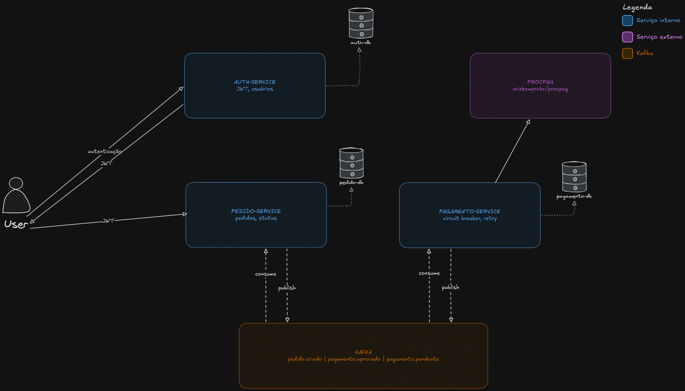
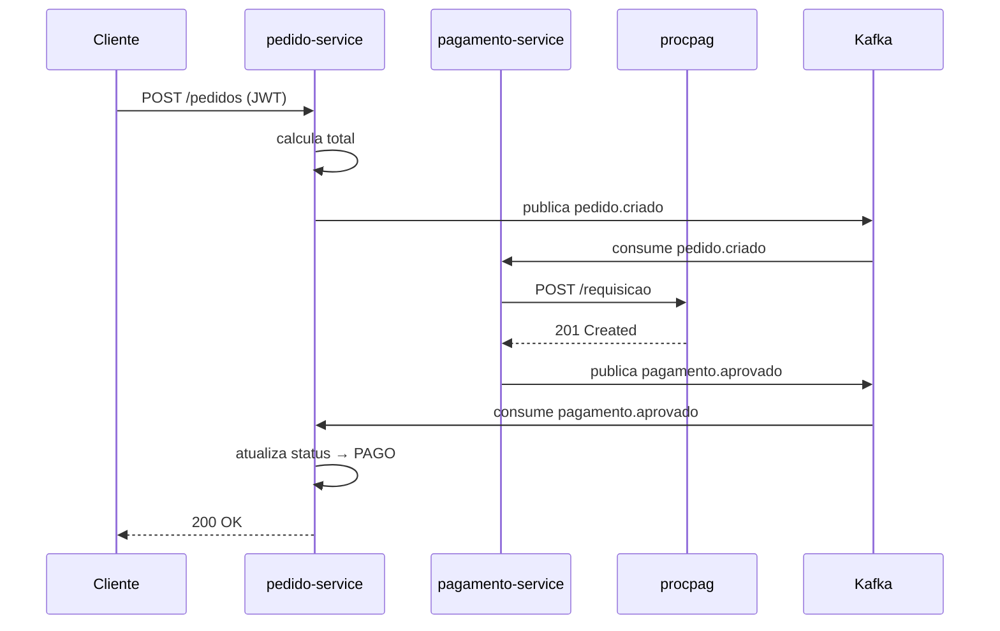
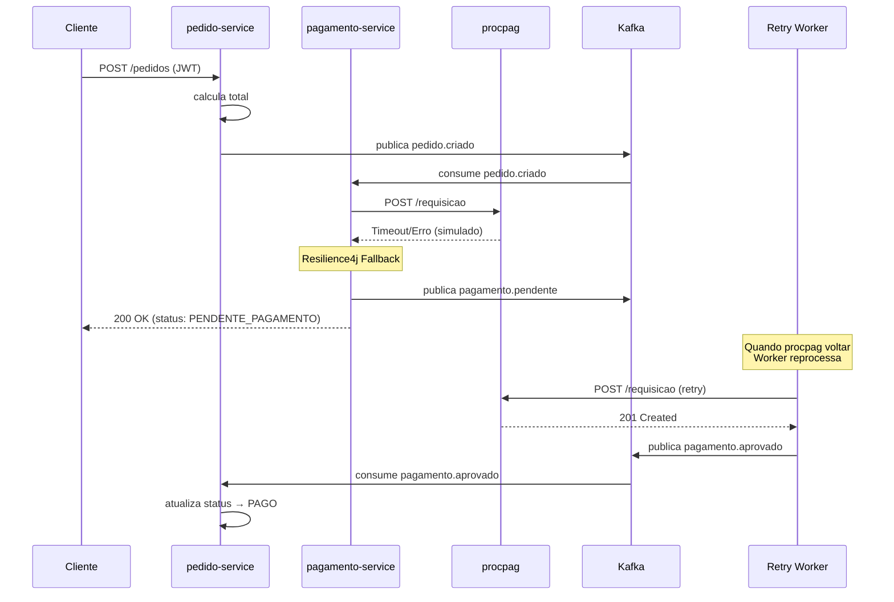

# Tech Challenge III

Sistema de pedidos online para restaurante com arquitetura de microsserviços.

## Visão Geral

Este projeto implementa um sistema de pedidos online para um restaurante, permitindo:

- Criação e gerenciamento de pedidos
- Processamento de pagamentos
- Controle de status de pedidos
- Resiliência a falhas

## Arquitetura



## Serviços

| Serviço | Porta | Descrição |
|---------|-------|-----------|
| auth-service | 8081 | Gerenciamento de usuários e autenticação JWT |
| pedido-service | 8082 | Gerenciamento de pedidos |
| pagamento-service | 8083 | Comunicação com serviço externo de pagamento |
| procpag | 8089 | Serviço externo de processamento de pagamentos |

## Tecnologias

- **Java 21+** com Spring Boot
- **Spring Security + JWT** para autenticação
- **Apache Kafka** para comunicação assíncrona
- **Resilience4j** para resiliência (Circuit Breaker, Retry, Timeout)
- **PostgreSQL** como banco de dados

## Requisitos Funcionais

### Gerenciamento de Usuários

- Criar cliente (cadastro)
- Autenticar cliente (login com JWT)

### Criar Pedido

- Dados do cliente (ID do token JWT)
- Lista de itens (produto, quantidade, preço)
- Cálculo automático do valor total

### Consultas

- Consultar pedido por ID
- Consultar todos os pedidos do cliente autenticado

### Processamento de Pagamento

- Integração com serviço externo (procpag)
- Pagamento Pendente quando serviço indisponível
- Reprocessamento automático

## Requisitos Não Funcionais

### Arquitetura em Múltiplos Serviços

- Mínimo: auth-service, pedido-service, pagamento-service
- Opcional: restaurante-service, api-gateway

### Segurança

- Endpoint de login gerando token JWT
- Perfis de acesso: CLIENTE, ADMIN
- Endpoints protegidos com token obrigatório
- ID do cliente extraído do token

### Comunicação Assíncrona com Kafka

Eventos:

- `pedido.criado` - Quando um pedido é criado
- `pagamento.aprovado` - Quando pagamento é confirmado
- `pagamento.pendente` - Quando serviço de pagamento está indisponível

### Resiliência (Resilience4j)

- Circuit Breaker
- Retry
- Timeout
- Fallback: marca pedido como PENDENTE_PAGAMENTO

## Fluxo Principal (Caminho Feliz)



## Fluxo de Resiliência (Falha)



## Status do Pedido

```
AGUARDANDO_PAGAMENTO → PAGO (sucesso)
AGUARDANDO_PAGAMENTO → PENDENTE_PAGAMENTO → PAGO (resiliência)
```

## Quick Start

```bash
# Subir todos os serviços
docker compose up -d

# Verificar status
docker compose ps
```

## Documentação

- [Arquitetura](./docs/ARCHITECTURE.md)
- [API](./docs/API.md)
- [Kafka](./docs/KAFKA.md)
- [Resiliência](./docs/RESILIENCE.md)
- [Autenticação](docs/autenticacao.md)

## Variáveis de Ambiente

```yaml
# auth-service
DATABASE_URL_AUTH: jdbc:postgresql://localhost:5432/authdb
JWT_SECRET: sua-chave-secreta-aqui

# pedido-service
DATABASE_URL_PEDIDO: jdbc:postgresql://localhost:5432/pedidodb

# pagamento-service
DATABASE_URL_PAGAMENTO: jdbc:postgresql://localhost:5432/pagamentodb
PROC_PAG_URL: http://procpag:8089
KAFKA_BOOTSTRAP_SERVERS: kafka:9092
```

### Build

#### Compile all modules

`mvn clean compile`

#### Compile with tests skipped (faster)

`mvn clean compile -DskipTests`

##### Build all modules (including tests)

`mvn clean package`

#### Build without running tests

`mvn clean package -DskipTests`

#### Build specific module

`mvn clean package -pl auth-service -am`
