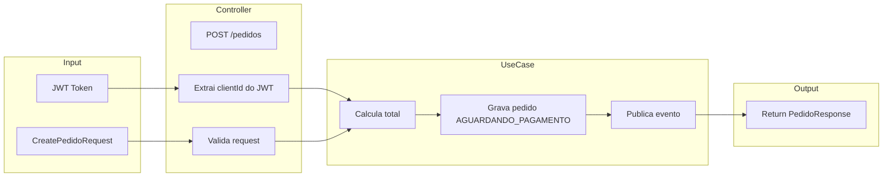

# Arquitetura do Sistema

## Visão de Componentes


## Stack Tecnológico

| Componente | Tecnologia | Versão |
|------------|------------|--------|
| Linguagem | Java | 21      |
| Framework | Spring Boot | 3.5.13    |
| Segurança | Spring Security + JWT | -      |
| Mensageria | Apache Kafka | 3.x    |
| Resiliência | Resilience4j | 2.x    |
| Banco de Dados | PostgreSQL | 15+    |
| Build | Maven | -      |

## Estrutura de Diretórios (Clean Architecture)

```
src/
├── main/
│   ├── java/
│   │   └── br/com/fiap/
│   │       └── [servico]/
│   │           ├── core/
│   │           │   ├── domain/         # Entidades e regras de negócio
│   │           │   ├── dto/            # DTO's para transicionar entre camadas
│   │           │   ├── exception/      # Exception's proprias
│   │           │   ├── gateway/        # Acesso a dados
│   │           │   ├── usecase/        # Casos de uso
│   │           ├── infra/              # Configurações e adaptadores
│   │           │   ├── controller/     # Endpoints REST
│   │           │   ├── gateway/
│   │           │   │   ├── db/         # Acesso a banco de dados
│   │           │   │   │   └── repository/
│   │           │   │   ├── http/       # API's externas
│   │           │   │   └── kafka/
│   │           │   └── security/       # Spring Security
│   │           └── [servico]Application.java
│   └── resources/
│       └── application.yml
└── test/
```

## Camadas

### Controller

- Exposition de endpoints REST
- Validação de input
- Conversão DTO ↔ Domain
- Tratamento de exceções HTTP

### Use Cases

- Orquestração de operações
- Regras de negócio
- Transações

### Domain

- Entidades (Pedido, Cliente, Pagamento, Item)
- Value Objects
- Regras de transição de estado

### Infra

- Repositórios (persistence)
- Produtores/Consumidores Kafka
- Configurações de segurança
- Clientes externos

## Fluxo de Dados

### Criação de Pedido



## Banco de Dados

### auth-service (auth-db)

```sql
CREATE TABLE users (
    id UUID PRIMARY KEY,
    nome VARCHAR(255) NOT NULL,
    email VARCHAR(255) UNIQUE NOT NULL,
    senha VARCHAR(255) NOT NULL,
    role VARCHAR(50) NOT NULL, -- CLIENTE, OWNER 
    created_at TIMESTAMP DEFAULT CURRENT_TIMESTAMP
);
```

### pedido-service (pedido-db)

```sql
CREATE TABLE pedidos (
    id UUID PRIMARY KEY,
    cliente_id UUID NOT NULL,
    status VARCHAR(50) NOT NULL, -- AGUARDANDO_PAGAMENTO, PAGO, PENDENTE_PAGAMENTO, CANCELADO
    valor_total DECIMAL(10,2) NOT NULL,
    created_at TIMESTAMP DEFAULT CURRENT_TIMESTAMP,
    updated_at TIMESTAMP DEFAULT CURRENT_TIMESTAMP
);

CREATE TABLE pedido_itens (
    id UUID PRIMARY KEY,
    pedido_id UUID REFERENCES pedidos(id),
    produto_id UUID NOT NULL,
    nome_produto VARCHAR(255) NOT NULL,
    quantidade INT NOT NULL,
    preco_unitario DECIMAL(10,2) NOT NULL
);
```

### pagamento-service (pagamento-db)

```sql
CREATE TABLE pagamentos (
    id UUID PRIMARY KEY,
    pedido_id UUID NOT NULL,
    pagamento_id_externo VARCHAR(255),
    status VARCHAR(50) NOT NULL, -- PENDENTE, APROVADO, RECUSADO
    valor DECIMAL(10,2) NOT NULL,
    created_at TIMESTAMP DEFAULT CURRENT_TIMESTAMP,
    updated_at TIMESTAMP DEFAULT CURRENT_TIMESTAMP
);
```

## Variáveis de Ambiente por Serviço

### auth-service

```yaml
SERVER_PORT: 8081
DATABASE_URL: jdbc:postgresql://postgres:5432/authdb
DATABASE_USERNAME: postgres
DATABASE_PASSWORD: postgres
JWT_SECRET: ${JWT_SECRET:default-secret-key}
JWT_EXPIRATION: 86400000
```

### pedido-service

```yaml
SERVER_PORT: 8082
DATABASE_URL: jdbc:postgresql://postgres:5432/pedidodb
DATABASE_USERNAME: postgres
DATABASE_PASSWORD: postgres
KAFKA_BOOTSTRAP_SERVERS: kafka:9092
SPRING_SECURITY_OAUTH2_RESOURCESERVER_JWT_ISSUER_URI: http://auth-service:8081
```

### pagamento-service

```yaml
SERVER_PORT: 8083
DATABASE_URL: jdbc:postgresql://postgres:5432/pagamentodb
DATABASE_USERNAME: postgres
DATABASE_PASSWORD: postgres
KAFKA_BOOTSTRAP_SERVERS: kafka:9092
PROC_PAG_URL: http://procpag:8089
SPRING_SECURITY_OAUTH2_RESOURCESERVER_JWT_ISSUER_URI: http://auth-service:8081
```

### procpag (fornecido)

```yaml
SERVER_PORT: 8089
```
