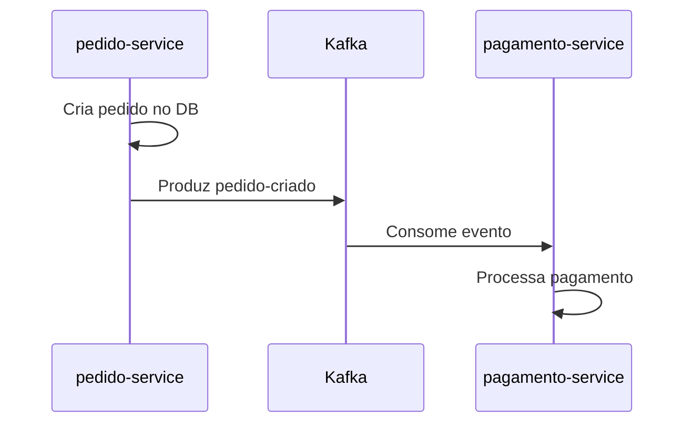
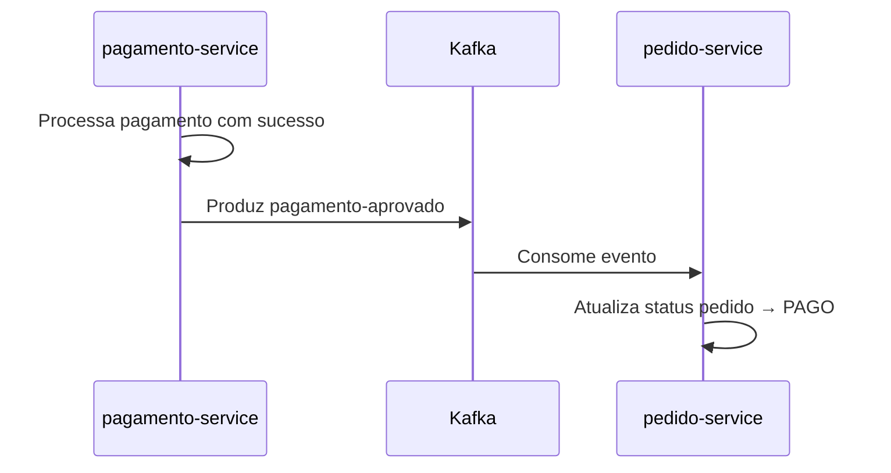
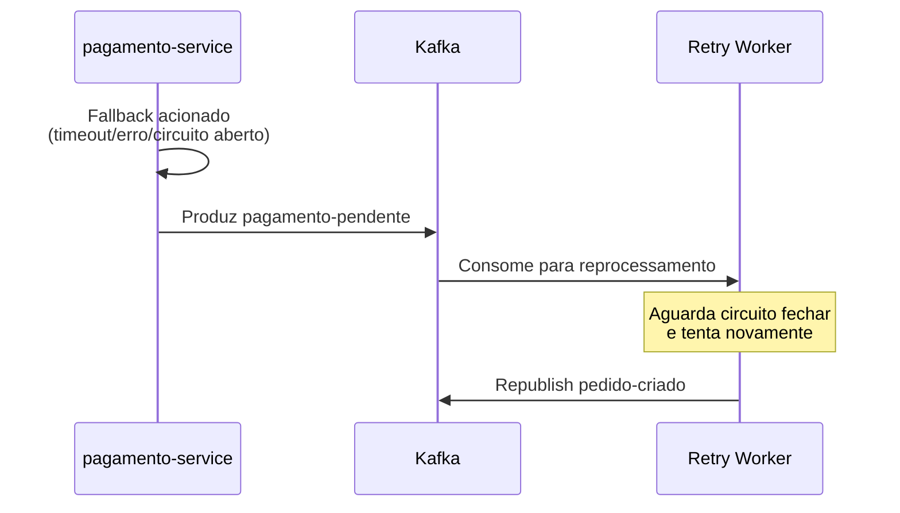

# Kafka - Comunicação Assíncrona

## Visão Geral

O sistema utiliza Apache Kafka para comunicação assíncrona entre os serviços, garantindo desacoplamento e resiliência.

## Tópicos

| Tópico | Descrição | Producer | Consumer |
|--------|-----------|----------|----------|
| `pedido-criado` | Evento quando um pedido é criado | pedido-service | pagamento-service |
| `pagamento-aprovado` | Evento quando pagamento é confirmado | pagamento-service | pedido-service |
| `pagamento-pendente` | Evento quando pagamento está pendente | pagamento-service | pagamento-service (retry worker) |

---

## Evento: pedido.criado

### Tópico
```
pedido-criado
```

### Schema
```json
{
  "eventType": "PEDIDO_CRIADO",
  "pedidoId": "uuid-pedido",
  "clienteId": "uuid-cliente",
  "valorTotal": 56.80,
  "itens": [
    {
      "produtoId": "uuid-produto",
      "nome": "Hamburguer",
      "quantidade": 2,
      "precoUnitario": 25.90
    }
  ],
  "timestamp": "2024-01-15T10:30:00Z"
}
```

### Fluxo


---

## Evento: pagamento.aprovado

### Tópico
```
pagamento-aprovado
```

### Schema
```json
{
  "eventType": "PAGAMENTO_APROVADO",
  "pedidoId": "uuid-pedido",
  "pagamentoId": "uuid-pagamento",
  "valor": 56.80,
  "timestamp": "2024-01-15T10:35:00Z"
}
```

### Fluxo


---

## Evento: pagamento.pendente

### Tópico
```
pagamento-pendente
```

### Schema
```json
{
  "eventType": "PAGAMENTO_PENDENTE",
  "pedidoId": "uuid-pedido",
  "pagamentoId": "uuid-pagamento",
  "motivo": "SERVICO_INDISPONIVEL",
  "timestamp": "2024-01-15T10:30:00Z"
}
```

### Fluxo (Resiliência)


---

## Configuração

### Producer (Spring Boot)

```yaml
spring:
  kafka:
    producer:
      bootstrap-servers: kafka:9092
      key-serializer: org.apache.kafka.common.serialization.StringSerializer
      value-serializer: org.springframework.kafka.support.serializer.JsonSerializer
      acks: all
      retries: 3
```

### Consumer (Spring Boot)

```yaml
spring:
  kafka:
    consumer:
      bootstrap-servers: kafka:9092
      group-id: pedido-group
      auto-offset-reset: earliest
      key-deserializer: org.apache.kafka.common.serialization.StringDeserializer
      value-deserializer: org.springframework.kafka.support.serializer.JsonDeserializer
      properties:
        spring.json.trusted.packages: "*"
```

---

## Consumer Groups

| Serviço | Group ID | Tópicos Consumidos |
|---------|----------|-------------------|
| pagamento-service | pagamento-group | pedido-criado |
| pedido-service | pedido-group | pagamento-aprovado, pagamento-pendente |
| pagamento-service (retry) | retry-group | pagamento-pendente |

---

## idempotência

Para garantir idempotência:
- Sempre verificar se o pedido já foi processado antes de aplicar mudanças
- Usar IDempotency-Key nos headers
- O status do pedido só pode mudar para frente (nunca reverso)

---

## Contract (Java Classes)

### PedidoCriadoEvent
```java
public record PedidoCriadoEvent(
    String eventType,
    UUID pedidoId,
    UUID clienteId,
    BigDecimal valorTotal,
    List<PedidoItem> itens,
    Instant timestamp
) {}
```

### PagamentoAprovadoEvent
```java
public record PagamentoAprovadoEvent(
    String eventType,
    UUID pedidoId,
    UUID pagamentoId,
    BigDecimal valor,
    Instant timestamp
) {}
```

### PagamentoPendenteEvent
```java
public record PagamentoPendenteEvent(
    String eventType,
    UUID pedidoId,
    UUID pagamentoId,
    String motivo,
    Instant timestamp
) {}
```
