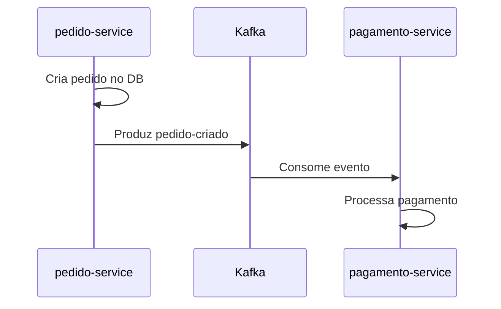
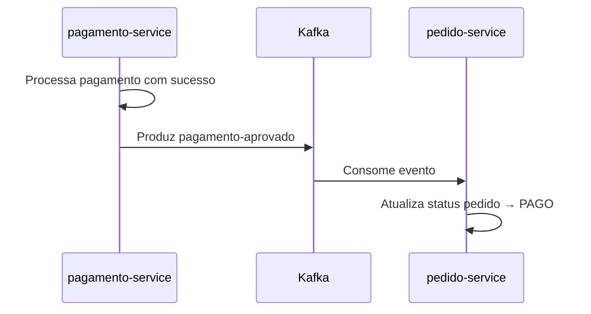
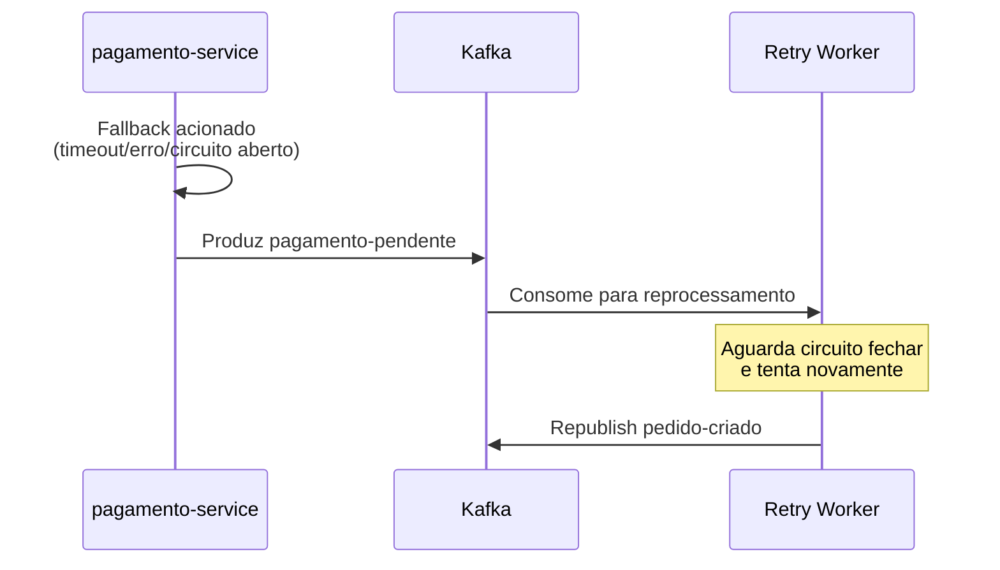

# Kafka - Comunicação Assíncrona

## Visão Geral

O sistema utiliza Apache Kafka para comunicação assíncrona entre os serviços, garantindo desacoplamento e resiliência.

## Tópicos

| Tópico | Descrição | Producer | Consumer |
|--------|-----------|----------|----------|
| `pedido-criado` | Evento quando um pedido é criado | pedido-service | pagamento-service |
| `pagamento-aprovado` | Evento quando pagamento é confirmado | pagamento-service | pedido-service |
| `pagamento-pendente` | Evento quando pagamento está pendente | pagamento-service | pagamento-service (retry worker) |

---

## Evento: pedido.criado

### Tópico

```
pedido-criado
```

### Schema

```json
{
  "orderId": "uuid-pedido",
  "clientId": "uuid-cliente",
  "totalAmount": 56,
  "timestamp": "2024-01-15T10:30:00Z"
}
```

### Fluxo


```mermaid
sequenceDiagram
    participant PS as pedido-service
    participant Kafka
    participant PgS as pagamento-service

    PS->>PS: Cria pedido no DB
    PS->>Kafka: Produz pedido-criado
    Kafka->>PgS: Consome evento
    PgS->>PgS: Processa pagamento
```

---

## Evento: pagamento.aprovado

### Tópico

```
pagamento-aprovado
```

### Schema

```json
{
  "pedidoId": "uuid-pedido",
  "pagamentoId": "uuid-pagamento",
  "valor": 580,
  "timestamp": "2024-01-15T10:35:00Z"
}
```

### Fluxo


```mermaid
sequenceDiagram
    participant PgS as pagamento-service
    participant Kafka
    participant PS as pedido-service

    PgS->>PgS: Processa pagamento com sucesso
    PgS->>Kafka: Produz pagamento-aprovado
    Kafka->>PS: Consome evento
    PS->>PS: Atualiza status pedido → PAGO
```

---

## Evento: pagamento.pendente

### Tópico

```
pagamento-pendente
```

### Schema

```json
{
  "pedidoId": "uuid-pedido",
  "pagamentoId": "uuid-pagamento",
  "timestamp": "2024-01-15T10:30:00Z"
}
```

### Fluxo (Resiliência)


```mermaid
sequenceDiagram
    participant PgS as pagamento-service
    participant Kafka
    participant Worker as Retry Worker

    PgS->>PgS: Fallback acionado<br/>(timeout/erro/circuito aberto)
    PgS->>Kafka: Produz pagamento-pendente
    Kafka->>Worker: Consome para reprocessamento
    
    Note over Worker: Aguarda circuito fechar<br/>e tenta novamente
    
    Worker->>Kafka: Republish pedido-criado
```

---

## Configuração

### Producer (Spring Boot)

```yaml
spring:
  kafka:
    producer:
      bootstrap-servers: kafka:9092
      key-serializer: org.apache.kafka.common.serialization.StringSerializer
      value-serializer: org.springframework.kafka.support.serializer.JsonSerializer
      acks: all
      retries: 3
```

### Consumer (Spring Boot)

```yaml
spring:
  kafka:
    consumer:
      bootstrap-servers: kafka:9092
      group-id: pedido-group
      auto-offset-reset: earliest
      key-deserializer: org.apache.kafka.common.serialization.StringDeserializer
      value-deserializer: org.springframework.kafka.support.serializer.JsonDeserializer
      properties:
        spring.json.trusted.packages: "*"
```

---

## Consumer Groups

| Serviço | Group ID | Tópicos Consumidos |
|---------|----------|-------------------|
| pagamento-service | pagamento-group | pedido-criado |
| pedido-service | pedido-group | pagamento-aprovado, pagamento-pendente |
| pagamento-service (retry) | retry-group | pagamento-pendente |

---

## idempotência

Para garantir idempotência:

- Sempre verificar se o pedido já foi processado antes de aplicar mudanças
- Usar IDempotency-Key nos headers
- O status do pedido só pode mudar para frente (nunca reverso)

---

## Contract (Java Classes)

### Topico pedido-criado

```java
public record OrderEvent(
        String orderId,
        String clientId,
        BigDecimal totalAmount,
        LocalDateTime timestamp) {
}
```

### Topico pagamento-aprovado

```java
public record PaymentEvent(
        String orderId,
        String paymentId,
        BigDecimal amount,
        LocalDateTime timestamp) {
}
```

### Topico pagamento-pendente

```java
public record PaymentEvent(
        String orderId,
        String paymentId,
        BigDecimal amount,
        LocalDateTime timestamp) {
}```
