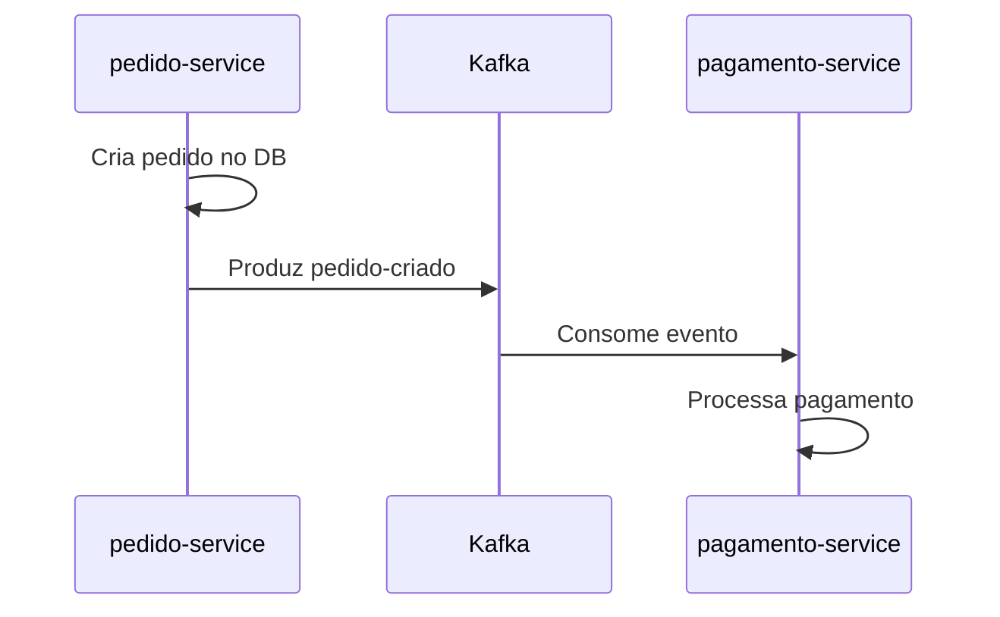
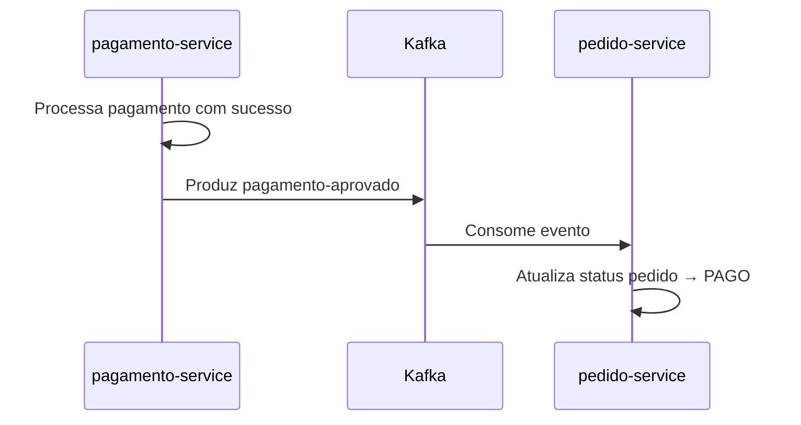
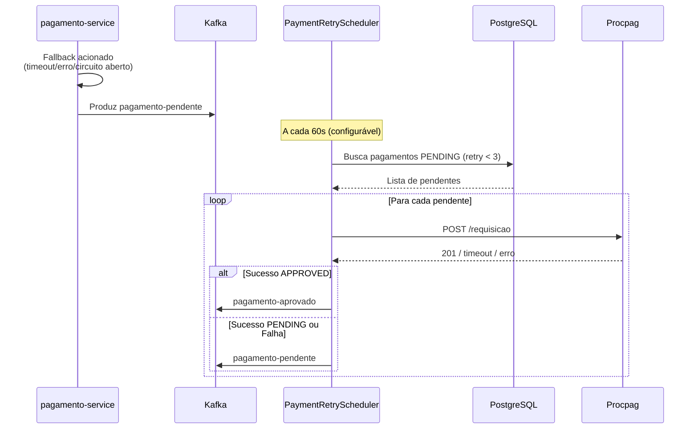

# Kafka - Comunicação Assíncrona

## Visão Geral

O sistema utiliza Apache Kafka para comunicação assíncrona entre os serviços, garantindo desacoplamento e resiliência.

## Tópicos

| Tópico | Descrição | Producer | Consumer |
|--------|-----------|----------|----------|
| `pedido-criado` | Evento quando um pedido é criado | pedido-service | pagamento-service |
| `pagamento-aprovado` | Evento quando pagamento é confirmado | pagamento-service | pedido-service |
| `pagamento-pendente` | Evento quando pagamento está pendente | pagamento-service | pedido-service |

---

## Evento: pedido.criado

### Tópico

```
pedido-criado
```

### Schema

```json
{
  "orderId": "uuid-pedido",
  "clientId": "uuid-cliente",
  "totalAmount": 56,
  "timestamp": "2024-01-15T10:30:00Z"
}
```

### Fluxo


```mermaid
sequenceDiagram
    participant PS as pedido-service
    participant Kafka
    participant PgS as pagamento-service

    PS->>PS: Cria pedido no DB
    PS->>Kafka: Produz pedido-criado
    Kafka->>PgS: Consome evento
    PgS->>PgS: Processa pagamento
```

---

## Evento: pagamento.aprovado

### Tópico

```
pagamento-aprovado
```

### Schema

```json
{
  "pedidoId": "uuid-pedido",
  "pagamentoId": "uuid-pagamento",
  "valor": 580,
  "timestamp": "2024-01-15T10:35:00Z"
}
```

### Fluxo


```mermaid
sequenceDiagram
    participant PgS as pagamento-service
    participant Kafka
    participant PS as pedido-service

    PgS->>PgS: Processa pagamento com sucesso
    PgS->>Kafka: Produz pagamento-aprovado
    Kafka->>PS: Consome evento
    PS->>PS: Atualiza status pedido → PAGO
```

---

## Evento: pagamento.pendente

### Tópico

```
pagamento-pendente
```

### Schema

```json
{
  "pedidoId": "uuid-pedido",
  "pagamentoId": "uuid-pagamento",
  "timestamp": "2024-01-15T10:30:00Z"
}
```

### Fluxo (Reprocessamento Agendado)


```mermaid
sequenceDiagram
    participant PgS as pagamento-service
    participant Kafka
    participant Scheduler as PaymentRetryScheduler
    participant DB as PostgreSQL
    participant Procpag as Procpag

    PgS->>PgS: Fallback acionado<br/>(timeout/erro/circuito aberto)
    PgS->>Kafka: Produz pagamento-pendente
    
    Note over Scheduler: A cada 60s (configurável)
    Scheduler->>DB: Busca pagamentos PENDING (retry < 3)
    DB-->>Scheduler: Lista de pendentes
    
    loop Para cada pendente
        Scheduler->>Procpag: POST /requisicao
        Procpag-->>Scheduler: 201 / timeout / erro
        alt Sucesso APPROVED
            Scheduler->>Kafka: pagamento-aprovado
        else Sucesso PENDING ou Falha
            Scheduler->>Kafka: pagamento-pendente
        end
    end
```

---

## Configuração

### Producer (Spring Boot)

```yaml
spring:
  kafka:
    producer:
      bootstrap-servers: kafka:9092
      key-serializer: org.apache.kafka.common.serialization.StringSerializer
      value-serializer: org.springframework.kafka.support.serializer.JsonSerializer
      acks: all
      retries: 3
```

### Consumer (Spring Boot)

```yaml
spring:
  kafka:
    consumer:
      bootstrap-servers: kafka:9092
      group-id: pedido-group
      auto-offset-reset: earliest
      key-deserializer: org.apache.kafka.common.serialization.StringDeserializer
      value-deserializer: org.springframework.kafka.support.serializer.JsonDeserializer
      properties:
        spring.json.trusted.packages: "*"
```

---

## Consumer Groups

| Serviço | Group ID | Tópicos Consumidos |
|---------|----------|-------------------|
| pagamento-service | pagamento-group | pedido-criado |
| pedido-service | pedido-group | pagamento-aprovado, pagamento-pendente |

---

## idempotência

Para garantir idempotência:

- Sempre verificar se o pedido já foi processado antes de aplicar mudanças
- Usar IDempotency-Key nos headers
- O status do pedido só pode mudar para frente (nunca reverso)

---

## Contract (Java Classes)

### Topico pedido-criado

```java
public record OrderEvent(
        String orderId,
        String clientId,
        BigDecimal totalAmount,
        LocalDateTime timestamp) {
}
```

### Topico pagamento-aprovado

```java
public record PaymentEvent(
        String orderId,
        String paymentId,
        BigDecimal amount,
        LocalDateTime timestamp) {
}
```

### Topico pagamento-pendente

```java
public record PaymentEvent(
        String orderId,
        String paymentId,
        BigDecimal amount,
        LocalDateTime timestamp) {
}
```

---

## Estratégia de Retry Multicamada

O sistema possui **3 camadas independentes de retry** que atuam em níveis diferentes da pilha. Elas são **complementares**, não redundantes — cada uma cobre um tipo de falha distinto.

### As 3 Camadas

| Camada | Local | Tentativas | Intervalo | Escopo |
|--------|-------|-----------|-----------|--------|
| **Producer retry** | `KafkaConfig.java:47` (`RETRIES_CONFIG`) | 3 | padrão Kafka (sem backoff explícito) | Envio da mensagem ao broker Kafka |
| **Consumer retry** | `KafkaConfig.java:87` (`DefaultErrorHandler` + `FixedBackOff`) | 3 | 5s fixed | Reentrega da mensagem ao listener |
| **Resilience4j Retry** | `application.properties` (`procPagRetry`) | 3 | 5s (exponential backoff via config) | Chamada HTTP externa ao Procpag |

### Interação

```
Kafka Consumer retry (entrega da mensagem ao listener)
  └─ Resilience4j retry (chamada HTTP ao Procpag)
       └─ Producer retry (envio do evento de resultado ao broker)
```

1. **Producer retry** — Retry de infraestrutura. Se o broker Kafka estiver temporariamente indisponível, o producer reenvia a mensagem automaticamente. Se exaurido, a exceção propaga para o caller do `KafkaTemplate.send()`.

2. **Consumer retry** — Quando o listener lança uma exceção (ex.: timeout ao chamar o Procpag), o `DefaultErrorHandler` reentrega a mensagem para o listener. Após 3 tentativas com 5s de intervalo, a mensagem é enviada para a DLQ `pedido-criado-dlq`. Exceções do tipo `IllegalArgumentException` não são retentadas (vão direto para a DLQ).

3. **Resilience4j Retry** — Atua dentro do listener, especificamente na chamada HTTP ao Procpag (`ProcPagHttpGateway`). Se a requisição falhar (timeout, erro HTTP, etc.), o Resilience4j retenta com 3 tentativas e 5s de espera entre elas (configurado em `application.properties`). Se todos os retries falharem, o fallback é acionado e o pagamento permanece como `PENDING`.

### Complementaridade

- **Consumer retry + Resilience4j retry** atuam em escopos diferentes:
  - O **Resilience4j** retenta a **chamada HTTP externa** — se o Procpag responder rápido na 2ª tentativa, não há necessidade de reentregar a mensagem Kafka.
  - O **Consumer retry** retenta a **entrega da mensagem** — se a exceção não for tratada pelo Resilience4j (ou se o listener falhar por outro motivo), o Kafka reentrega a mensagem inteira.

- **Tempo máximo estimado**: Se as 3 camadas forem acionadas sequencialmente (pior caso), o tempo total pode chegar a ~55s, conforme detalhado em [docs/resilience.md](resilience.md).

> ⚠️ A configuração detalhada do Resilience4j (Retry, Circuit Breaker, Timeout, Fallback) e do worker agendado de reprocessamento está documentada em [docs/resilience.md](resilience.md).

