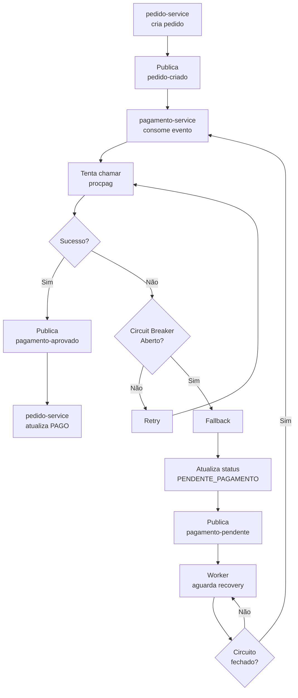
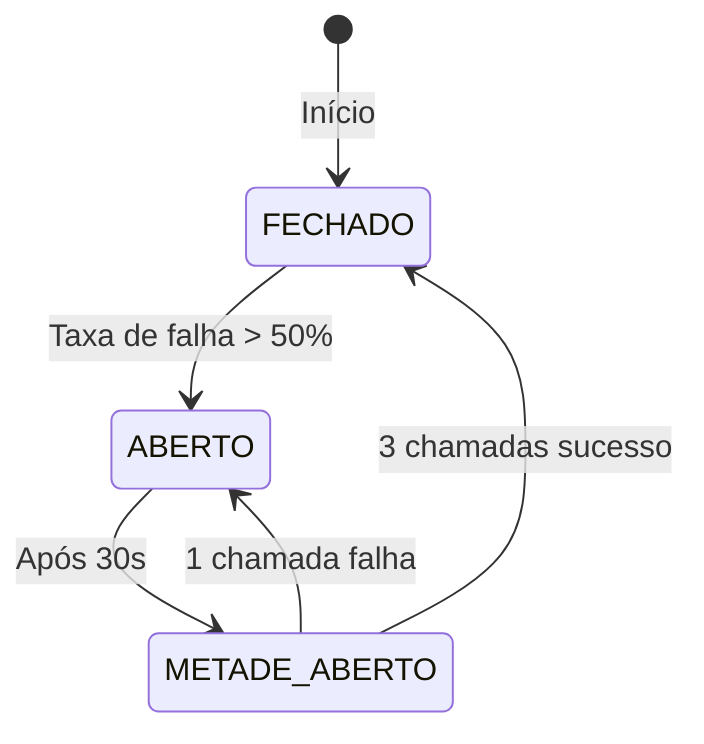

# Resiliência

## Visão Geral

O sistema utiliza **Resilience4j** para implementar padrões de resiliência nas chamadas ao serviço externo de pagamento.

## Padrões Implementados

| Padrão | Descrição |
|---------|-----------|
| Circuit Breaker | Evita chamadas consecutivas a serviço falhando |
| Retry | Tenta novamente em caso de falha |
| Timeout | Limita tempo de espera por resposta |
| Fallback | Ação alternativa quando todas as tentativas falham |

---

## Configuração Resilience4j

### application.yml (pagamento-service)

```yaml
resilience4j:
  circuitbreaker:
    instances:
      procpag:
        registerHealthIndicator: true
        slidingWindowSize: 10
        minimumNumberOfCalls: 5
        permittedNumberOfCallsInHalfOpenState: 3
        automaticTransitionFromOpenToHalfOpenEnabled: true
        waitDurationInOpenState: 30s
        failureRateThreshold: 50
        eventConsumerBufferSize: 10

  retry:
    instances:
      procpag:
        maxAttempts: 3
        waitDuration: 2s
        enableExponentialBackoff: true
        exponentialBackoffMultiplier: 2
        retryExceptions:
          - java.io.IOException
          - java.util.concurrent.TimeoutException

  timelimiter:
    instances:
      procpag:
        timeoutDuration: 5s
        cancelRunningFuture: true
```

---

## Implementação

### Service com Annotations

```java
@Service
@RequiredArgsConstructor
public class PagamentoService {

    private final PagamentoExternalClient externalClient;
    private final PedidoEventProducer eventProducer;
    private final PedidoRepository pedidoRepository;

    @CircuitBreaker(name = "procpag", fallbackMethod = "processarPagamentoFallback")
    @Retry(name = "procpag")
    @TimeLimiter(name = "procpag")
    public void processarPagamento(PedidoCriadoEvent event) {
        // Chama o serviço externo
        RequisicaoPagamentoRequest request = new RequisicaoPagamentoRequest(
            event.pedidoId().toString(),
            event.clienteId().toString(),
            event.valorTotal().intValue()
        );
        
        externalClient.enviarRequisicao(request);
        
        // Se sucesso, publica evento de aprovação
        eventProducer.publicarPagamentoAprovado(new PagamentoAprovadoEvent(...));
    }

    private void processarPagamentoFallback(PedidoCriadoEvent event, Exception ex) {
        // Fallback: marca como pendente e envia para fila
        pedidoRepository.atualizarStatus(event.pedidoId(), StatusPedido.PENDENTE_PAGAMENTO);
        
        eventProducer.publicarPagamentoPendente(new PagamentoPendenteEvent(
            "PAGAMENTO_PENDENTE",
            event.pedidoId(),
            null,
            "SERVICO_INDISPONIVEL: " + ex.getMessage(),
            Instant.now()
        ));
    }
}
```

---

## Fluxo de Resiliência



---

## Estados do Circuit Breaker



### Estados

| Estado | Descrição | Comportamento |
|--------|-----------|----------------|
| FECHADO | Normal | Chamadas normais, failures são contados |
| ABERTO | Falhas excessivas | Chamadas bloquadas, retorna fallback imediatamente |
| METADE_ABERTO | Recovery | Permite algumas chamadas para testar recuperação |

---

## Timeout

- Tempo máximo de espera: **5 segundos**
- Após timeout, o Retry entra em ação
- Se todos os retries falharem, o Fallback é executado

---

## Fallback

Quando todas as tentativas falham (timeout, erro HTTP, circuito aberto):

1. **Atualiza pedido**: Marca como `PENDENTE_PAGAMENTO`
2. **Publica evento**: Envia para tópico `pagamento-pendente`
3. **Retorna**: Requisição original recebe resposta de sucesso (pedido criado com status pendente)

---

## Reprocessamento (Retry Worker)

O sistema deve implementar um worker que:
1. Consome do tópico `pagamento-pendente`
2. Verifica periodicamente se o circuit breaker está fechado
3. Quando fechado, tenta processar novamente
4. Em caso de sucesso, publica `pagamento-aprovado`

```java
@Component
public class PagamentoRetryWorker {

    private final CircuitBreakerRegistry circuitBreakerRegistry;
    private final PagamentoService pagamentoService;

    @Scheduled(fixedDelay = 30000) // A cada 30 segundos
    public void reprocessarPendentes() {
        CircuitBreaker circuitBreaker = circuitBreakerRegistry.circuitBreaker("procpag");
        
        if (circuitBreaker.getState() == CircuitBreaker.State.CLOSED ||
            circuitBreaker.getState() == CircuitBreaker.State.HALF_OPEN) {
            
            List<PagamentoPendente> pendentes = buscarPagamentosPendentes();
            for (PagamentoPendente pendente : pendentes) {
                try {
                    pagamentoService.reprocessar(pendente);
                } catch (Exception e) {
                    log.error("Erro ao reprocessar pagamento {}", pendente.getId(), e);
                }
            }
        }
    }
}
```

---

## Métricas

Endpoints de saúde e métricas:

```
GET /actuator/health
GET /actuator/circuitbreakers
GET /actuator/circuitbreakers/events
GET /actuator/resilience4j.circuitbreaker.events
```

---

## Boas Práticas

1. **Idempotência**: Sempre verificar se o pagamento já foi processado antes de reprocessar
2. **Logging**: Registrar todas as tentativas e fallbacks
3. **Métricas**: Monitorar taxa de falhas e tempo de resposta
4. **Graceful Degradation**: Sistema continua funcionando mesmo com falhas
