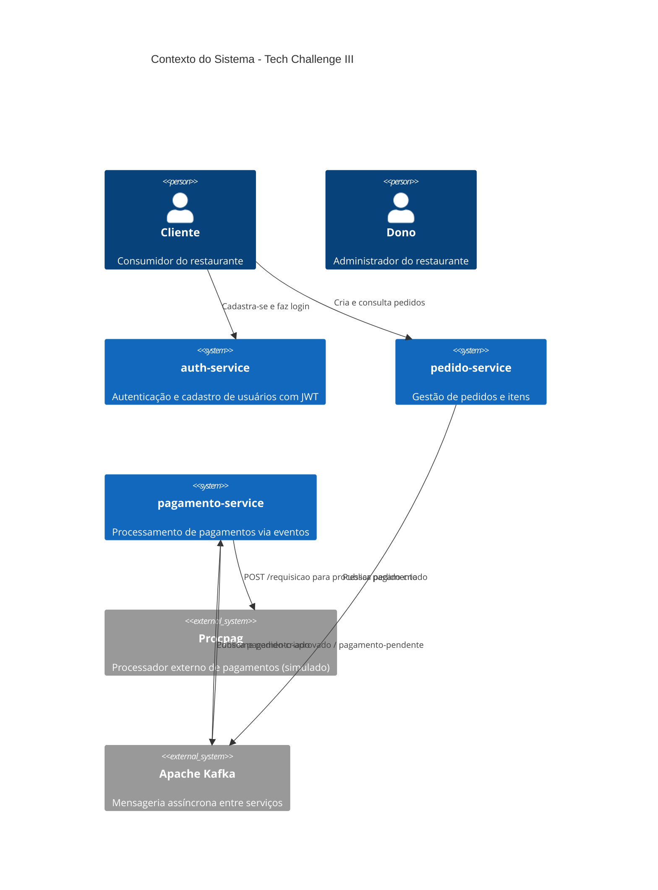
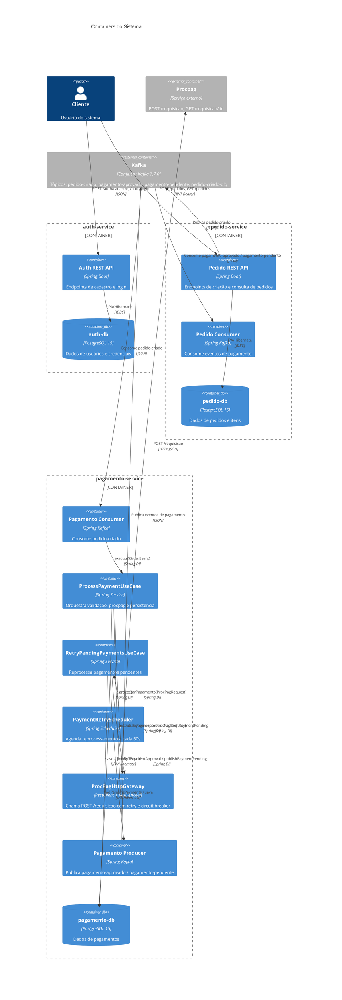
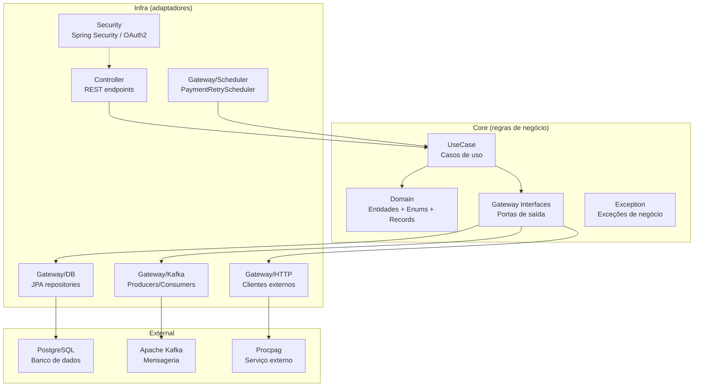
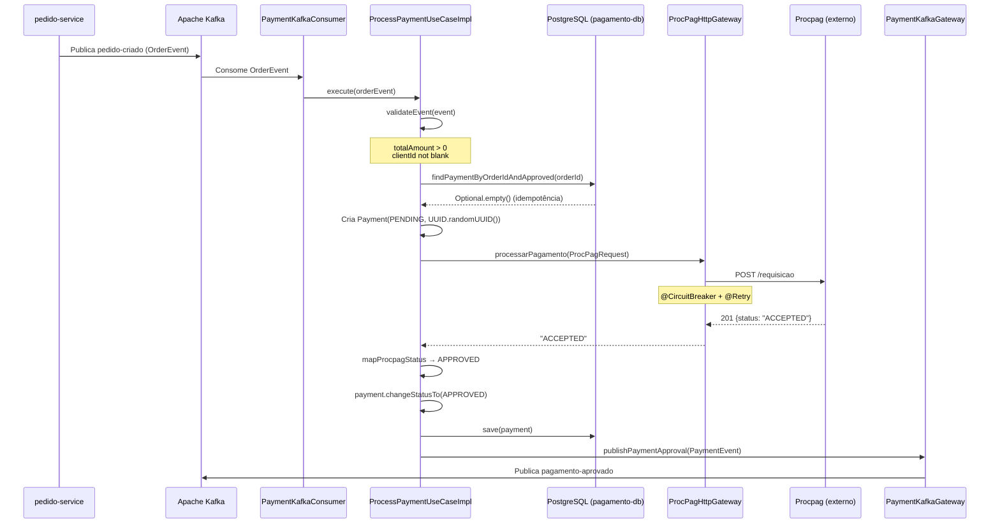
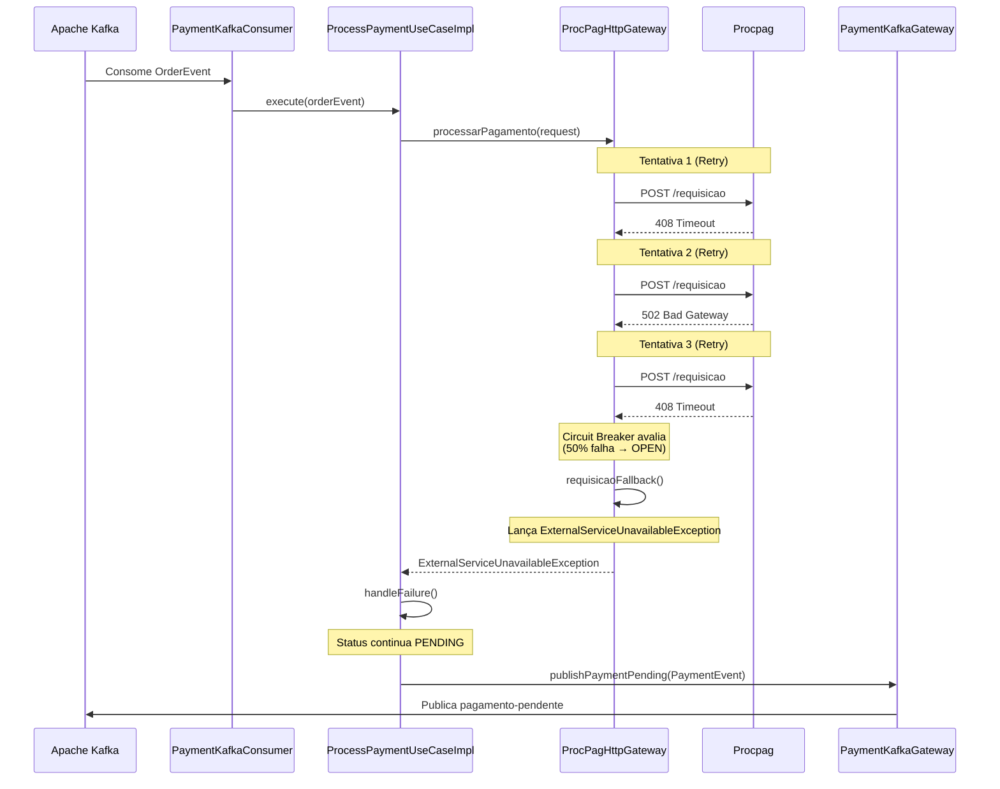
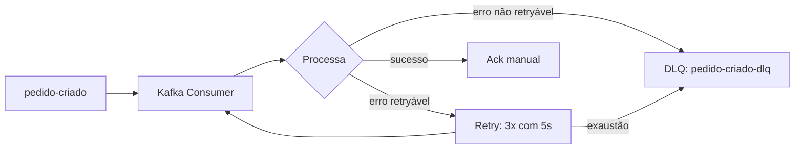
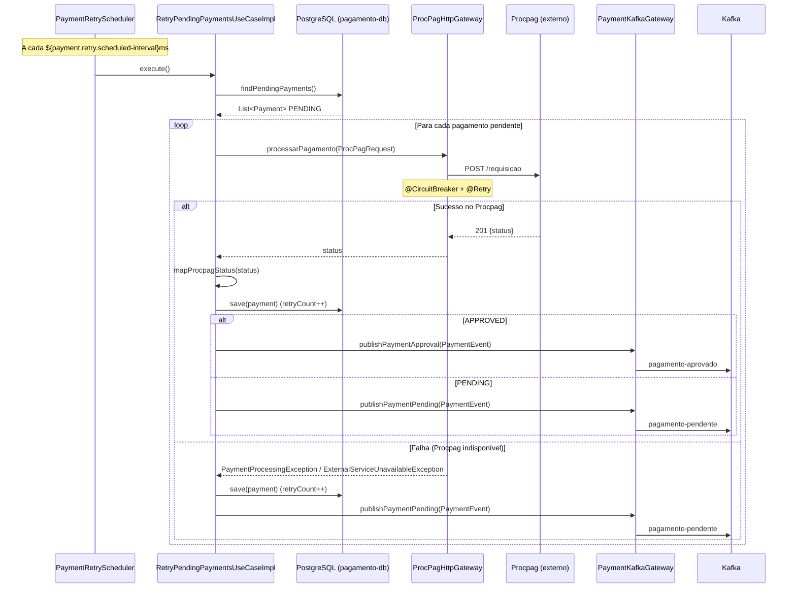

# Arquitetura do Sistema

## Visão Geral

Sistema de pedidos online para restaurante, implementado com **microsserviços em Java 21 + Spring Boot 3.2.5**,
seguindo os princípios de **Clean Architecture**. A comunicação assíncrona entre serviços é feita via **Apache Kafka**,
e o processamento de pagamentos delega a um serviço externo (**Procpag**) com resiliência via **Resilience4j**.

### Estado dos Módulos

| Módulo | Porta | Situação |
|--------|-------|----------|
| `auth-service` | 8081 | **Stub** — apenas `pom.xml` e diretório de migração vazio |
| `pedido-service` | 8082 | **Stub** — apenas `pom.xml` e diretório de migração vazio |
| `pagamento-service` | 8083 | **Implementado** — domínio, casos de uso, gateways (DB/HTTP/Kafka), testes |
| `procpag` (externo) | 8089 | **Fornecido** — simulador de processadora de pagamentos |

---

## Diagrama de Contexto (C4 — Nível 1)



---

## Diagrama de Containers (C4 — Nível 2)



---

## Stack Tecnológico

| Componente | Tecnologia | Versão |
|------------|------------|--------|
| Linguagem | Java | 21 |
| Framework | Spring Boot | 3.2.5 |
| Segurança | Spring Security + OAuth2 Resource Server + JWT | - |
| Mensageria | Apache Kafka (KRaft mode, sem Zookeeper) | 7.7.0 |
| Resiliência | Resilience4j (Retry + Circuit Breaker) | 2.2.0 |
| Banco de Dados | PostgreSQL | 15+ |
| Migrações | Flyway | 10.10.0 |
| Build | Maven (multi-module) | - |
| HTTP Client | Spring RestClient | - |

---

## Estrutura de Diretórios (Clean Architecture)

```
src/
├── main/
│   ├── java/
│   │   └── br/com/fiap/
│   │       └── [servico]/
│   │           ├── core/
│   │           │   ├── domain/         # Entidades, records, enums, regras de negócio
│   │           │   ├── dto/            # DTOs para transicionar entre camadas
│   │           │   ├── exception/      # Exceções de negócio e sistema
│   │           │   ├── gateway/        # Interfaces de portas (saída)
│   │           │   ├── usecase/        # Casos de uso (entrada)
│   │           ├── infra/
│   │           │   ├── controller/     # Endpoints REST
│   │           │   ├── gateway/
│   │           │   │   ├── db/         # Implementação JPA (entity, repository, mapper)
│   │   │   │   ├── http/       # Clientes HTTP para APIs externas
│   │   │   │   ├── kafka/      # Producers e consumers Kafka
│   │   │   │   └── scheduler/  # Agendadores (retry worker, etc.)
│   │           │   └── security/       # Configuração Spring Security / OAuth2
│   │           └── [servico]Application.java
│   └── resources/
│       ├── application.properties      # (formato .properties, não .yml)
│       └── db/migration/               # Migrations Flyway
└── test/
    └── java/
        └── br/com/fiap/[servico]/      # Testes unitários e de integração
```

> **Nota:** O pacote real do `pagamento-service` é `br.com.fiap.payment` (inglês), não `br.com.fiap.pagamento`.

---

## Camadas



### Controller

- Exposição de endpoints REST
- Validação de input (DTO → domínio)
- Extração de claims do JWT (`clientId`)
- Tratamento de exceções HTTP
- *(Implementado apenas no pagamento-service, que expõe `/actuator/health`)*

### Use Cases

- Orquestração de operações de negócio
- Chamada a portas (gateways) definidas no domínio
- Transações e tratamento de erros
- **Implementado:** `ProcessPaymentUseCaseImpl` e `RetryPendingPaymentsUseCaseImpl` no pagamento-service

### Domain

- Entidades (`Payment`) com regras de transição de estado (forward-only)
- Records (`OrderEvent`, `PaymentEvent`, `ProcPagRequest`)
- Enums (`PaymentStatus: APPROVED | PENDING`)
- Interfaces de gateway (`PaymentGateway`, `ProcPagGateway`, `PaymentEventGateway`)
- Exceções específicas (`OrderAlreadyCreatedException`, `PaymentProcessingException`, `ExternalServiceUnavailableException`)

### Infra

- **db/**: `PaymentEntity` (JPA), `PaymentEntityRepository`, `PaymentMapper`, `PaymentSpringDataGateway`
- **http/**: `ProcPagHttpGateway` com `RestClient` + Resilience4j (Retry + Circuit Breaker)
- **kafka/**: `PaymentKafkaConsumer` (consome `pedido-criado`), `PaymentKafkaGateway` (publica resultados), `KafkaConfig` (DLQ configurada)
- **scheduler/**: `PaymentRetryScheduler` (reprocessamento agendado de pagamentos pendentes via `@Scheduled`)
- **security/**: Diretório preparado, aguardando implementação

---

## Fluxo de Dados — Processamento de Pagamento

### Caminho Feliz



### Fluxo de Resiliência (Falha do Procpag)



### Dead Letter Queue (DLQ)

Eventos inválidos ou não processados após retries são enviados ao tópico `pedido-criado-dlq`:



---

### Reprocessamento Agendado (Retry Worker)

O `PaymentRetryScheduler` executa a cada 60s (configurável) e reprocessa pagamentos com status `PENDING` e `retry_count < 3`:



---

## Banco de Dados

Cada microsserviço possui seu próprio banco PostgreSQL dedicado, gerenciado pelo Flyway.

### auth-service (auth-db)

```sql
CREATE TABLE users (
    id UUID PRIMARY KEY,
    nome VARCHAR(255) NOT NULL,
    email VARCHAR(255) UNIQUE NOT NULL,
    senha VARCHAR(255) NOT NULL,
    role VARCHAR(50) NOT NULL, -- CLIENTE, OWNER
    created_at TIMESTAMP DEFAULT CURRENT_TIMESTAMP
);
```

### pedido-service (pedido-db)

```sql
CREATE TABLE pedidos (
    id UUID PRIMARY KEY,
    cliente_id UUID NOT NULL,
    status VARCHAR(50) NOT NULL, -- AGUARDANDO_PAGAMENTO, PAGO, PENDENTE_PAGAMENTO, CANCELADO
    valor_total DECIMAL(10,2) NOT NULL,
    created_at TIMESTAMP DEFAULT CURRENT_TIMESTAMP,
    updated_at TIMESTAMP DEFAULT CURRENT_TIMESTAMP
);

CREATE TABLE pedido_itens (
    id UUID PRIMARY KEY,
    pedido_id UUID REFERENCES pedidos(id),
    produto_id UUID NOT NULL,
    nome_produto VARCHAR(255) NOT NULL,
    quantidade INT NOT NULL,
    preco_unitario DECIMAL(10,2) NOT NULL
);
```

### pagamento-service (pagamento-db)

```sql
CREATE TABLE payment (
    payment_id UUID PRIMARY KEY,
    order_id VARCHAR(255) NOT NULL UNIQUE,
    client_id VARCHAR(255) NOT NULL,
    total_amount DECIMAL(19,2) NOT NULL,
    payment_status VARCHAR(20) NOT NULL, -- APPROVED, PENDING
    retry_count INTEGER DEFAULT 0,
    created_at TIMESTAMP DEFAULT CURRENT_TIMESTAMP,
    updated_at TIMESTAMP DEFAULT CURRENT_TIMESTAMP
);

CREATE INDEX idx_payment_status_created_at ON payment(payment_status, created_at);
```

O `PaymentStatus` possui apenas **dois valores** (definidos no enum `br.com.fiap.payment.core.domain.PaymentStatus`):

| Valor | Descrição |
|-------|-----------|
| `APPROVED` | Pagamento aprovado pelo processador externo |
| `PENDING` | Pagamento pendente (ainda não processado ou falhou) |

**Controle de tentativas:** A coluna `retry_count` (INTEGER, default 0) controla quantas vezes o pagamento foi reprocessado. O worker agendado só seleciona pagamentos com `retry_count < 3` (configurável via `payment.retry.max-attempts`).

**Regra de transição de status** (forward-only):
- `PENDING → APPROVED` — permitido
- `PENDING → PENDING` — permitido (reprocessamento)
- `APPROVED → *` — **bloqueado** (lança `IllegalStateException`)

> Para detalhes completos do modelo, consulte [data-model.md](data-model.md).

---

## Eventos Kafka

| Tópico | Producer | Consumer | Schema |
|--------|----------|----------|--------|
| `pedido-criado` | pedido-service | pagamento-service | `OrderEvent(orderId, clientId, totalAmount, timestamp)` |
| `pagamento-aprovado` | pagamento-service | pedido-service | `PaymentEvent(orderId, paymentId, amount, timestamp)` |
| `pagamento-pendente` | pagamento-service | pedido-service | `PaymentEvent(orderId, paymentId, amount, timestamp)` |
| `pedido-criado-dlq` | pagamento-service (DLQ) | — | `OrderEvent` original |

> Para detalhes completos sobre schemas, consumer groups e configuração, consulte [KAFKA.md](KAFKA.md).

---

## Variáveis de Ambiente por Serviço

### auth-service

```properties
SERVER_PORT=8081
SPRING_DATASOURCE_URL=jdbc:postgresql://auth-db:5432/authdb
SPRING_DATASOURCE_USERNAME=authdb
SPRING_DATASOURCE_PASSWORD=authdb
JWT_SECRET=${JWT_SECRET:default-secret-key}
JWT_EXPIRATION=86400000
```

### pedido-service

```properties
SERVER_PORT=8082
SPRING_DATASOURCE_URL=jdbc:postgresql://pedido-db:5432/pedidodb
SPRING_DATASOURCE_USERNAME=pedidodb
SPRING_DATASOURCE_PASSWORD=pedidodb
KAFKA_BOOTSTRAP_SERVERS=kafka:9092
SPRING_SECURITY_OAUTH2_RESOURCESERVER_JWT_ISSUER_URI=http://auth-service:8081
```

### pagamento-service

```properties
SERVER_PORT=8083
SPRING_DATASOURCE_URL=jdbc:postgresql://pagamento-db:5432/pagamentodb
SPRING_DATASOURCE_USERNAME=pagamentodb
SPRING_DATASOURCE_PASSWORD=pagamentodb
KAFKA_BOOTSTRAP_SERVERS=kafka:9092
KAFKA_CONSUMER_GROUP_ID=pagamento-group
PROCPAG_URL=http://procpag:8089
KAFKA_TOPIC_PAGAMENTO_APROVADO=pagamento-aprovado
KAFKA_TOPIC_PAGAMENTO_PENDENTE=pagamento-pendente
KAFKA_TOPIC_PEDIDO_CRIADO=pedido-criado
KAFKA_TOPIC_PEDIDO_CRIADO_DLQ=pedido-criado-dlq
KAFKA_PUBLISH_TIMEOUT=30
PAYMENT_RETRY_SCHEDULED_INTERVAL=60000
PAYMENT_RETRY_MAX_ATTEMPTS=3
SPRING_SECURITY_OAUTH2_RESOURCESERVER_JWT_ISSUER_URI=http://auth-service:8081
```

### procpag (fornecido)

```properties
SERVER_PORT=8089
```

---

## Resiliência (Resilience4j)

Aplicada exclusivamente no `pagamento-service` para chamadas HTTP ao Procpag:

| Padrão | Nome | Configuração |
|--------|------|-------------|
| **Circuit Breaker** | `procPagCircuitBreaker` | sliding-window=10, min-calls=5, threshold=50%, wait=30s |
| **Retry** | `procPagRetry` | max-attempts=3, wait=5s |

A ordem de execução é: **Circuit Breaker → Retry** (aspectos configurados com `circuitBreakerAspectOrder=1`, `retryAspectOrder=2`).

O fallback (`requisicaoFallback`) lança `ExternalServiceUnavailableException`, que é capturada pelo `ProcessPaymentUseCaseImpl` para persistir o status `PENDING` e publicar `pagamento-pendente`.

> Para detalhes completos, consulte [resilience.md](resilience.md).
