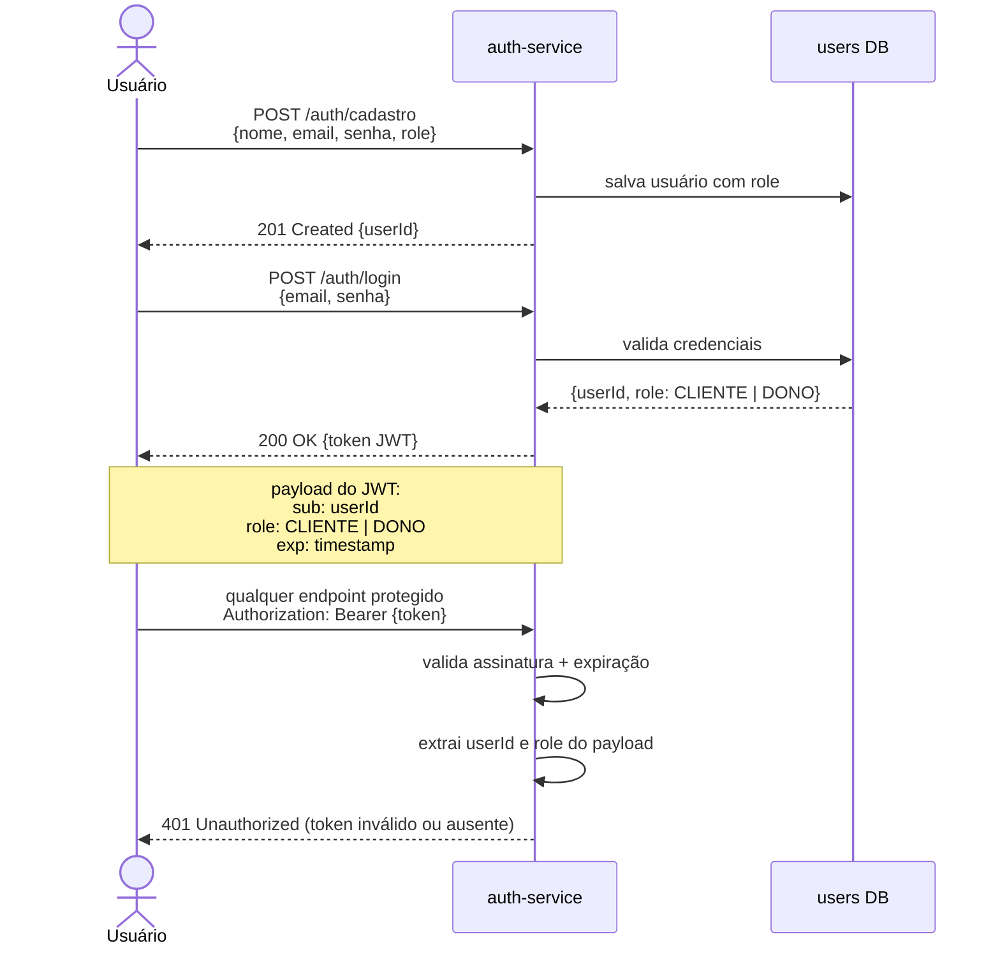
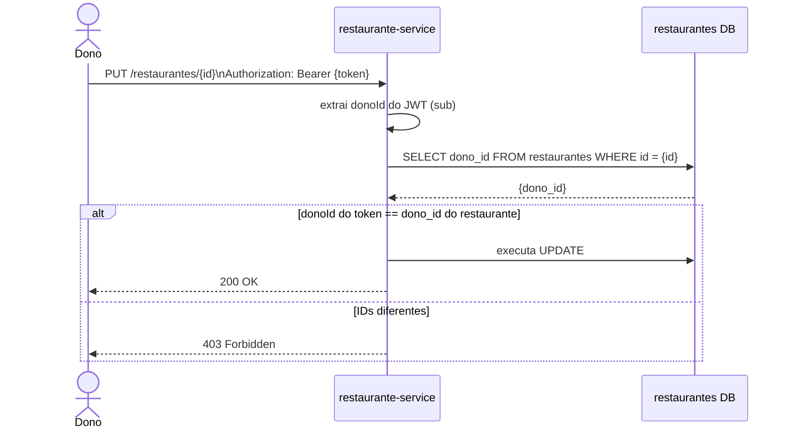

# Autenticação e Autorização

## 1. Fluxo de autenticação — login e uso do token

```mermaid
sequenceDiagram
    actor U as Usuário
    participant Auth as auth-service
    participant DB as users DB

    U->>Auth: POST /auth/cadastro<br/>{nome, email, senha, role}
    Auth->>DB: salva usuário com role
    Auth-->>U: 201 Created {userId}

    U->>Auth: POST /auth/login<br/>{email, senha}
    Auth->>DB: valida credenciais
    DB-->>Auth: {userId, role: CLIENTE | DONO}
    Auth-->>U: 200 OK {token JWT}

    Note over U,Auth: payload do JWT:<br/>sub: userId<br/>role: CLIENTE | DONO<br/>exp: timestamp

    U->>Auth: qualquer endpoint protegido<br/>Authorization: Bearer {token}
    Auth->>Auth: valida assinatura + expiração
    Auth->>Auth: extrai userId e role do payload
    Auth-->>U: 401 Unauthorized (token inválido ou ausente)
```

## 2. Autorização por recurso — dono só acessa o próprio restaurante

```mermaid
sequenceDiagram
    actor Dono
    participant RS as restaurante-service
    participant DB as restaurantes DB

    Dono->>RS: PUT /restaurantes/{id}\nAuthorization: Bearer {token}

    RS->>RS: extrai donoId do JWT (sub)
    RS->>DB: SELECT dono_id FROM restaurantes WHERE id = {id}
    DB-->>RS: {dono_id}

    alt donoId do token == dono_id do restaurante
        RS->>DB: executa UPDATE
        RS-->>Dono: 200 OK
    else IDs diferentes
        RS-->>Dono: 403 Forbidden
    end
```
