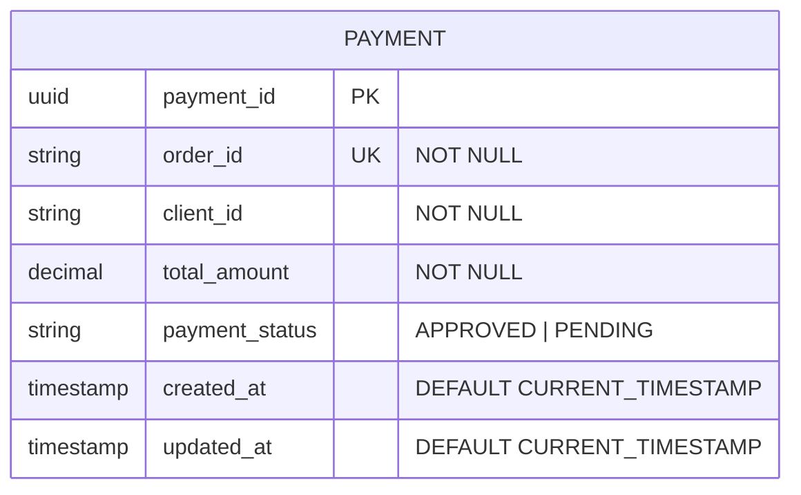
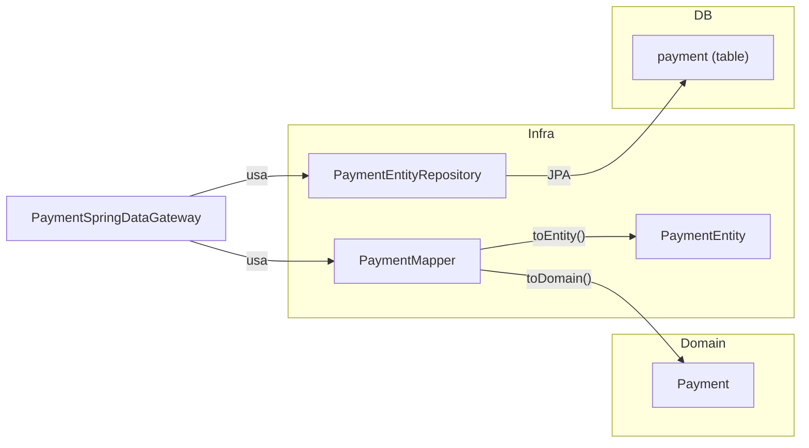

# Modelo de Dados — pagamento-service

## Entidade: Payment

Entidade central do domínio de pagamentos. Representa a tentativa de processamento de um pagamento para um pedido.

### Tabela: `payment`

| Coluna | Tipo | Restrições | Descrição |
|--------|------|------------|-----------|
| `payment_id` | `UUID` | `PK` | Identificador único do pagamento |
| `order_id` | `VARCHAR(255)` | `NOT NULL`, `UNIQUE` | ID do pedido associado |
| `client_id` | `VARCHAR(255)` | `NOT NULL` | ID do cliente |
| `total_amount` | `DECIMAL(19,2)` | `NOT NULL` | Valor total do pagamento |
| `payment_status` | `VARCHAR(20)` | `NOT NULL` | Status atual (`APPROVED` ou `PENDING`) |
| `created_at` | `TIMESTAMP` | `DEFAULT CURRENT_TIMESTAMP` | Data de criação |
| `updated_at` | `TIMESTAMP` | `DEFAULT CURRENT_TIMESTAMP` | Data da última atualização |

### SQL (Flyway V1)

```sql
CREATE TABLE payment (
    payment_id UUID PRIMARY KEY,
    order_id VARCHAR(255) NOT NULL UNIQUE,
    client_id VARCHAR(255) NOT NULL,
    total_amount DECIMAL(19,2) NOT NULL,
    payment_status VARCHAR(20) NOT NULL,
    created_at TIMESTAMP DEFAULT CURRENT_TIMESTAMP,
    updated_at TIMESTAMP DEFAULT CURRENT_TIMESTAMP
);
```

### Diagrama ER



## Enum: `PaymentStatus`

| Valor | Descrição |
|-------|-----------|
| `APPROVED` | Pagamento aprovado pelo processador externo |
| `PENDING` | Pagamento pendente (processador retornou pendente ou falhou) |

### Regra de transição de status

O status é **forward-only**: uma vez `APPROVED`, não é possível reverter para `PENDING` ou aplicar qualquer outra transição. Tentativas de transição inválidas lançam `IllegalStateException`.

```
PENDING ──→ APPROVED   (válido)
PENDING ──→ PENDING    (válido — reprocessamento)
APPROVED ──→ *         (inválido — lança exceção)
```

## Domain Records / DTOs

### `OrderEvent` (entrada — consumido do Kafka)

| Campo | Tipo | Descrição |
|-------|------|-----------|
| `orderId` | `String` | ID do pedido |
| `clientId` | `String` | ID do cliente |
| `totalAmount` | `BigDecimal` | Valor total do pedido |
| `timestamp` | `LocalDateTime` | Timestamp do evento |

Tópico de origem: `pedido-criado`

### `PaymentEvent` (saída — publicado no Kafka)

| Campo | Tipo | Descrição |
|-------|------|-----------|
| `orderId` | `String` | ID do pedido |
| `paymentId` | `String` | ID do pagamento |
| `amount` | `BigDecimal` | Valor processado |
| `timestamp` | `LocalDateTime` | Timestamp do evento |

Tópicos de destino: `pagamento-aprovado` ou `pagamento-pendente`

### `ProcPagRequest` (domínio — requisição ao processador externo)

| Campo | Tipo | Descrição |
|-------|------|-----------|
| `paymentId` | `UUID` | ID do pagamento |
| `clientId` | `String` | ID do cliente |
| `amount` | `BigDecimal` | Valor |

### `ProcPagHttpRequest` (HTTP — enviado ao Procpag)

| Campo | Tipo | JSON | Descrição |
|-------|------|------|-----------|
| `pagamentoId` | `String` | `pagamento_id` | ID do pagamento |
| `clienteId` | `String` | `cliente_id` | ID do cliente |
| `valor` | `BigDecimal` | `valor` | Valor do pagamento |

### `ProcPagHttpResponse` (HTTP — resposta do Procpag)

| Campo | Tipo | JSON | Descrição |
|-------|------|------|-----------|
| `status` | `String` | `status` | `ACCEPTED`, `PENDING` ou outro |

## Mapeamento JPA


