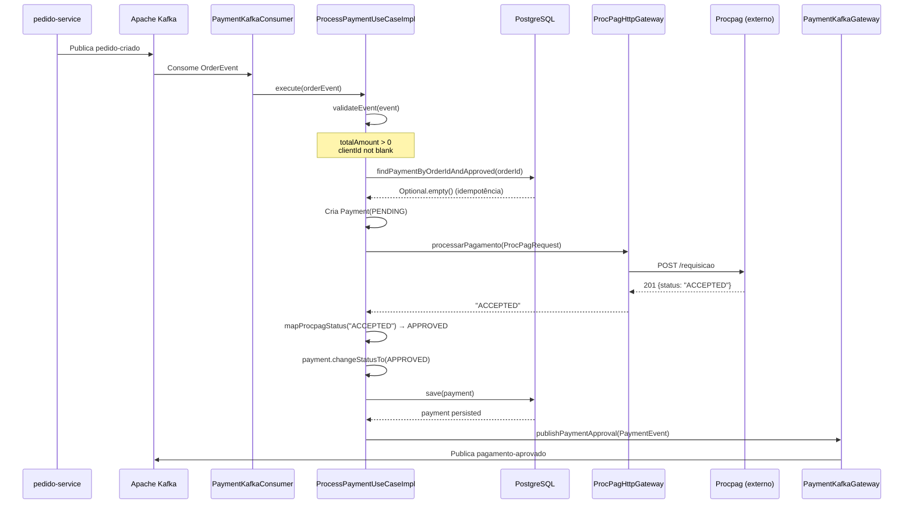
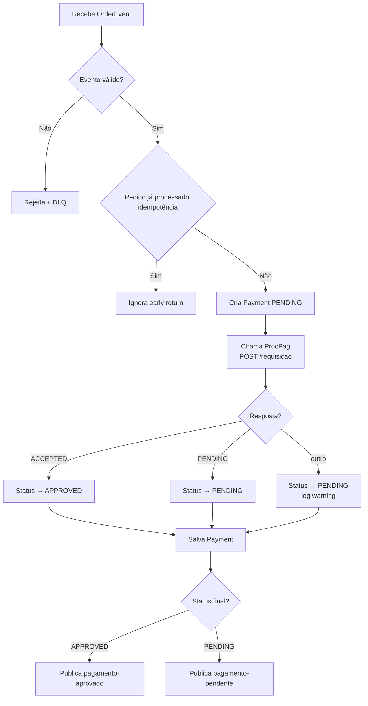
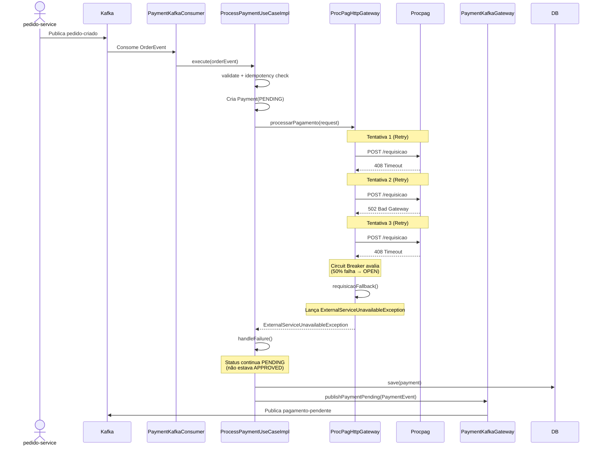
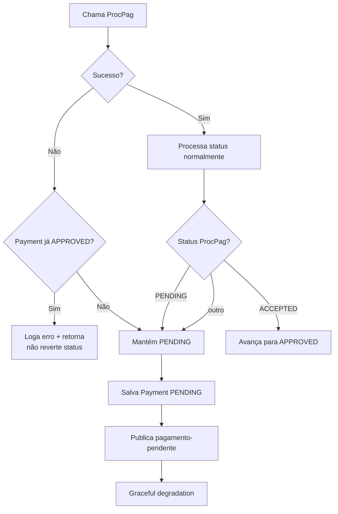
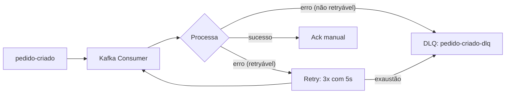

# Fluxos Principais — pagamento-service

## Fluxo 1: Processamento de Pagamento (Caminho Feliz)

### Descrição

Quando um pedido é criado no `pedido-service`, um evento `pedido-criado` é publicado no Kafka. O `pagamento-service` consome esse evento, processa o pagamento junto ao processador externo Procpag e publica o resultado.

### Diagrama de Sequência

### Diagrama de Decisão

## Fluxo 2: Falha no Processamento (Resiliência)

### Descrição

Quando o Procpag retorna erro ou está indisponível, o Resilience4j entra em ação com Retry e Circuit Breaker. Após exaustão das tentativas, o fallback publica um evento `pagamento-pendente`.

### Diagrama de Sequência

### Diagrama de Decisão — Tratamento de Erros

## Fluxo 3: Dead Letter Queue (DLQ)

### Descrição

Eventos que falham no processamento (validação ou erros não recuperáveis) vão para a DLQ após as tentativas de retry do Kafka consumer.

### Configuração do Error Handler

- **Dead Letter Publishing**: `DeadLetterPublishingRecoverer` → tópico `pedido-criado-dlq`
- **Backoff**: `FixedBackOff(5000L, 3)` — 5 segundos de intervalo, 3 tentativas
- **Exceções não retryáveis**: `IllegalArgumentException` (validação de evento)
- **Modo de acknowledgment**: manual (`Acknowledgment.acknowledge()`)
