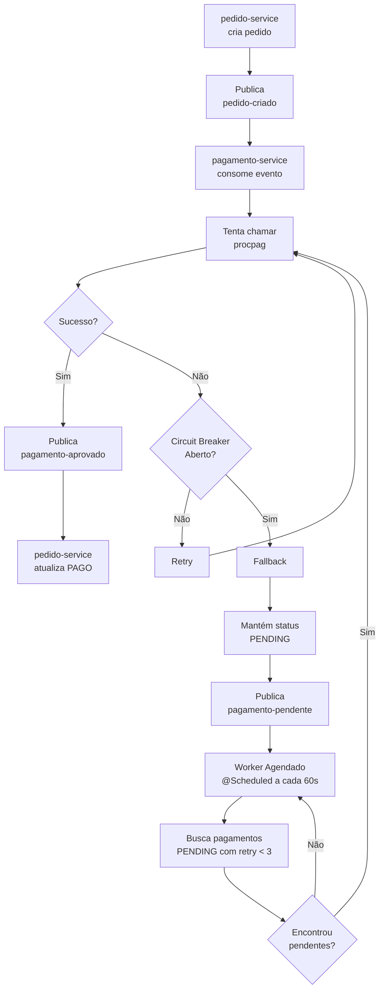
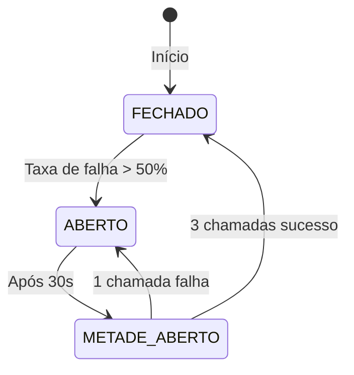

# Resiliência

## Visão Geral

O sistema utiliza **Resilience4j** para implementar padrões de resiliência nas chamadas ao serviço externo de pagamento.

## Padrões Implementados

| Padrão | Descrição |
|---------|-----------|
| Circuit Breaker | Evita chamadas consecutivas a serviço falhando |
| Retry | Tenta novamente em caso de falha |
| Timeout | Limita tempo de espera por resposta (connect + read configurados no RestClient) |
| Fallback | Ação alternativa quando todas as tentativas falham |

---

## Configuração Resilience4j

### application.properties (pagamento-service)

```properties
# Resilience4j Retry
resilience4j.retry.instances.procPagRetry.max-attempts=3
resilience4j.retry.instances.procPagRetry.wait-duration=5s
resilience4j.retry.instances.procPagRetry.retry-exceptions[0]=java.lang.Exception

# Resilience4j CircuitBreaker
resilience4j.circuitbreaker.instances.procPagCircuitBreaker.sliding-window-size=10
resilience4j.circuitbreaker.instances.procPagCircuitBreaker.minimum-number-of-calls=5
resilience4j.circuitbreaker.instances.procPagCircuitBreaker.failure-rate-threshold=50
resilience4j.circuitbreaker.instances.procPagCircuitBreaker.wait-duration-in-open-state=30s
resilience4j.circuitbreaker.instances.procPagCircuitBreaker.permitted-number-of-calls-in-half-open-state=3

# Aspect order: CircuitBreaker runs before Retry
resilience4j.circuitbreaker.circuitBreakerAspectOrder=1
resilience4j.retry.retryAspectOrder=2
```

---

## Implementação

### ProcPagHttpGateway com Annotations

```java
@Slf4j
@Service
public class ProcPagHttpGateway implements ProcPagGateway {

    private final RestClient restClient;

    public ProcPagHttpGateway(RestClient.Builder restClientBuilder,
            @Value("${procpag.url}") String procpagUrl,
            @Value("${procpag.connect-timeout}") Duration connectTimeout,
            @Value("${procpag.read-timeout}") Duration readTimeout) {
        HttpClient httpClient = HttpClient.newBuilder()
                .connectTimeout(connectTimeout)
                .build();
        JdkClientHttpRequestFactory requestFactory = new JdkClientHttpRequestFactory(httpClient);
        requestFactory.setReadTimeout(readTimeout);
        this.restClient = restClientBuilder
                .baseUrl(procpagUrl)
                .requestFactory(requestFactory)
                .build();
    }

    @Override
    @CircuitBreaker(name = "procPagCircuitBreaker", fallbackMethod = "requisicaoFallback")
    @Retry(name = "procPagRetry", fallbackMethod = "requisicaoFallback")
    public String processPayment(ProcPagRequest request) {
        return postHttpRequest(request);
    }

    private String postHttpRequest(ProcPagRequest request) { ... }

    public String requisicaoFallback(ProcPagRequest request, Exception ex) { ... }
}
```

---

## Fluxo de Resiliência



---

## Estados do Circuit Breaker



### Estados

| Estado | Descrição | Comportamento |
|--------|-----------|----------------|
| FECHADO | Normal | Chamadas normais, failures são contados |
| ABERTO | Falhas excessivas | Chamadas bloquadas, retorna fallback imediatamente |
| METADE_ABERTO | Recovery | Permite algumas chamadas para testar recuperação |

---

## Timeouts HTTP no RestClient

Timeouts explícitos configurados no `ProcPagHttpGateway` via `JdkClientHttpRequestFactory`:

| Timeout | Valor | Propriedade | Descrição |
|---------|-------|-------------|-----------|
| Connect | 5s | `procpag.connect-timeout` | Tempo máximo para estabelecer conexão TCP com o Procpag |
| Read | 10s | `procpag.read-timeout` | Tempo máximo para receber a resposta após conexão estabelecida |

- Ambos são parametrizáveis via `application.properties`
- Valores definidos em `application.properties`:
  ```properties
  procpag.connect-timeout=5s
  procpag.read-timeout=10s
  ```
- Após timeout (connect ou read), o `@Retry(name = "procPagRetry")` entra em ação com 3 tentativas e 5s de espera entre elas
- Se todos os retries falharem, o Fallback é executado
- Tempo máximo estimado por chamada completa (3 tentativas + waits): ~55s

---

## Fallback

Quando todas as tentativas falham (timeout, erro HTTP, circuito aberto) no fluxo principal (event-driven):

1. **Mantém status PENDING**: O pagamento permanece com status `PENDING` no banco local
2. **Incrementa retryCount**: (quando aplicável) A tentativa é contabilizada
3. **Publica evento**: Envia para tópico `pagamento-pendente` para que o `pedido-service` e o worker agendado tomem ciência
4. **Worker agendado**: O `PaymentRetryScheduler` reprocessará o pagamento na próxima execução agendada (se `retryCount < 3`)

---

## Reprocessamento (Retry Worker)

O reprocessamento de pagamentos pendentes é feito por um worker **agendado** (`@Scheduled`) que consulta o banco de dados diretamente, sem consumir tópicos Kafka:

### Componentes

| Componente | Classe | Função |
|-----------|--------|--------|
| Agendador | `PaymentRetryScheduler` | `@Scheduled(fixedDelayString = "${payment.retry.scheduled-interval:60000}")` — dispara a cada 60s (configurável) |
| Caso de Uso | `RetryPendingPaymentsUseCaseImpl` | Orquestra a lógica de reprocessamento |
| Gateway | `PaymentGateway#findPendingPayments()` | JPQL: `WHERE status = PENDING AND retryCount < 3` |

### Fluxo

1. O `PaymentRetryScheduler.retryPendingPayments()` é chamado a cada `payment.retry.scheduled-interval` ms
2. O `RetryPendingPaymentsUseCaseImpl.execute()` consulta o banco por pagamentos com `paymentStatus = PENDING` e `retryCount < 3`
3. Para cada pagamento pendente:
   - Monta um `ProcPagRequest` e chama `ProcPagGateway.processPayment()` (que passa pelo Circuit Breaker + Retry do Resilience4j)
   - **Sucesso**: mapeia o status do Procpag (`ACCEPTED → APPROVED`, `PENDING → PENDING`), incrementa `retryCount`, salva e publica o evento correspondente no Kafka
   - **Falha** (`PaymentProcessingException` / `ExternalServiceUnavailableException`): incrementa `retryCount`, salva e publica `pagamento-pendente`
   - **Erro inesperado**: loga e continua para o próximo pagamento (não interrompe o lote)

### Configuração

```properties
# Intervalo entre execuções do scheduler (ms)
payment.retry.scheduled-interval=60000

# Número máximo de tentativas por pagamento
payment.retry.max-attempts=3
```

### Código

```java
@Component
@RequiredArgsConstructor
public class PaymentRetryScheduler {

    private final RetryPendingPaymentsUseCase retryPendingPaymentsUseCase;

    @Scheduled(fixedDelayString = "${payment.retry.scheduled-interval:60000}")
    public void retryPendingPayments() {
        retryPendingPaymentsUseCase.execute();
    }
}
```

```java
@Slf4j
@Service
@RequiredArgsConstructor
public class RetryPendingPaymentsUseCaseImpl implements RetryPendingPaymentsUseCase {

    private final PaymentGateway paymentGateway;
    private final ProcPagGateway procPagGateway;
    private final PaymentEventGateway eventGateway;

    @Value("${payment.retry.max-attempts:3}")
    private int maxRetryAttempts;

    @Override
    public void execute() {
        var pendingPayments = paymentGateway.findPendingPayments();
        // ... reprocessa cada pagamento
    }
}
```

> ⚠️ **Diferença importante:** O worker não verifica explicitamente o estado do Circuit Breaker. As anotações `@CircuitBreaker` + `@Retry` no `ProcPagHttpGateway.processPayment()` tratam automaticamente: se o circuito estiver aberto, o fallback é disparado imediatamente, e o `retryCount` é incrementado normalmente.

---

## Métricas

Endpoints de saúde e métricas:

```
GET /actuator/health
GET /actuator/circuitbreakers
GET /actuator/circuitbreakers/events
GET /actuator/resilience4j.circuitbreaker.events
```

---

## Boas Práticas

1. **Idempotência**: Sempre verificar se o pagamento já foi processado antes de reprocessar
2. **Logging**: Registrar todas as tentativas e fallbacks
3. **Métricas**: Monitorar taxa de falhas e tempo de resposta
4. **Graceful Degradation**: Sistema continua funcionando mesmo com falhas
