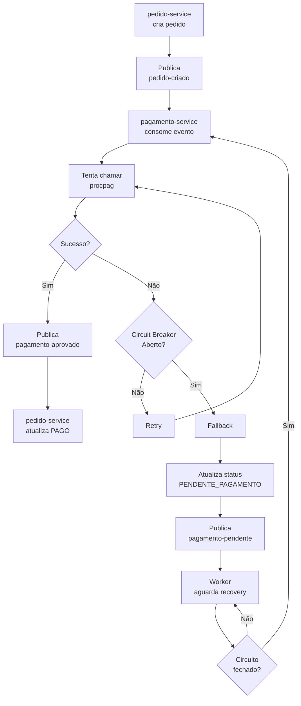
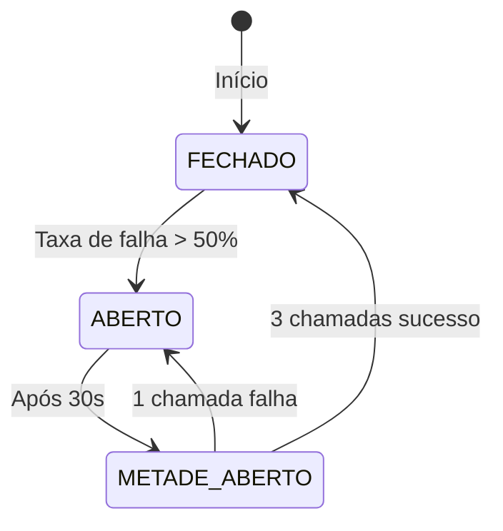

# Resiliência

## Visão Geral

O sistema utiliza **Resilience4j** para implementar padrões de resiliência nas chamadas ao serviço externo de pagamento.

## Padrões Implementados

| Padrão | Descrição |
|---------|-----------|
| Circuit Breaker | Evita chamadas consecutivas a serviço falhando |
| Retry | Tenta novamente em caso de falha |
| Timeout | Limita tempo de espera por resposta (connect + read configurados no RestClient) |
| Fallback | Ação alternativa quando todas as tentativas falham |

---

## Configuração Resilience4j

### application.properties (pagamento-service)

```properties
# Resilience4j Retry
resilience4j.retry.instances.procPagRetry.max-attempts=3
resilience4j.retry.instances.procPagRetry.wait-duration=5s
resilience4j.retry.instances.procPagRetry.retry-exceptions[0]=java.lang.Exception

# Resilience4j CircuitBreaker
resilience4j.circuitbreaker.instances.procPagCircuitBreaker.sliding-window-size=10
resilience4j.circuitbreaker.instances.procPagCircuitBreaker.minimum-number-of-calls=5
resilience4j.circuitbreaker.instances.procPagCircuitBreaker.failure-rate-threshold=50
resilience4j.circuitbreaker.instances.procPagCircuitBreaker.wait-duration-in-open-state=30s
resilience4j.circuitbreaker.instances.procPagCircuitBreaker.permitted-number-of-calls-in-half-open-state=3

# Aspect order: CircuitBreaker runs before Retry
resilience4j.circuitbreaker.circuitBreakerAspectOrder=1
resilience4j.retry.retryAspectOrder=2
```

> **Nota:** O `TimeLimiter` não está implementado. O controle de timeout é feito no nível do `RestClient` (ver seção [Timeouts HTTP no RestClient](#timeouts-http-no-restclient)).

---

## Implementação

### ProcPagHttpGateway com Annotations

```java
@Slf4j
@Service
public class ProcPagHttpGateway implements ProcPagGateway {

    private final RestClient restClient;

    public ProcPagHttpGateway(RestClient.Builder restClientBuilder,
            @Value("${procpag.url}") String procpagUrl,
            @Value("${procpag.connect-timeout}") Duration connectTimeout,
            @Value("${procpag.read-timeout}") Duration readTimeout) {
        HttpClient httpClient = HttpClient.newBuilder()
                .connectTimeout(connectTimeout)
                .build();
        JdkClientHttpRequestFactory requestFactory = new JdkClientHttpRequestFactory(httpClient);
        requestFactory.setReadTimeout(readTimeout);
        this.restClient = restClientBuilder
                .baseUrl(procpagUrl)
                .requestFactory(requestFactory)
                .build();
    }

    @Override
    @CircuitBreaker(name = "procPagCircuitBreaker", fallbackMethod = "requisicaoFallback")
    @Retry(name = "procPagRetry", fallbackMethod = "requisicaoFallback")
    public String processarPagamento(ProcPagRequest request) {
        return postHttpRequest(request);
    }

    private String postHttpRequest(ProcPagRequest request) { ... }

    public String requisicaoFallback(ProcPagRequest request, Exception ex) { ... }
}
```

---

## Fluxo de Resiliência



---

## Estados do Circuit Breaker



### Estados

| Estado | Descrição | Comportamento |
|--------|-----------|----------------|
| FECHADO | Normal | Chamadas normais, failures são contados |
| ABERTO | Falhas excessivas | Chamadas bloquadas, retorna fallback imediatamente |
| METADE_ABERTO | Recovery | Permite algumas chamadas para testar recuperação |

---

## Timeouts HTTP no RestClient

Timeouts explícitos configurados no `ProcPagHttpGateway` via `JdkClientHttpRequestFactory`:

| Timeout | Valor | Propriedade | Descrição |
|---------|-------|-------------|-----------|
| Connect | 5s | `procpag.connect-timeout` | Tempo máximo para estabelecer conexão TCP com o Procpag |
| Read | 10s | `procpag.read-timeout` | Tempo máximo para receber a resposta após conexão estabelecida |

- Ambos são parametrizáveis via `application.properties`
- Valores definidos em `application.properties`:
  ```properties
  procpag.connect-timeout=5s
  procpag.read-timeout=10s
  ```
- Após timeout (connect ou read), o `@Retry(name = "procPagRetry")` entra em ação com 3 tentativas e 5s de espera entre elas
- Se todos os retries falharem, o Fallback é executado
- Tempo máximo estimado por chamada completa (3 tentativas + waits): ~55s

---

## Fallback

Quando todas as tentativas falham (timeout, erro HTTP, circuito aberto):

1. **Atualiza pedido**: Marca como `PENDENTE_PAGAMENTO`
2. **Publica evento**: Envia para tópico `pagamento-pendente`
3. **Retorna**: Requisição original recebe resposta de sucesso (pedido criado com status pendente)

---

## Reprocessamento (Retry Worker)

O sistema deve implementar um worker que:

1. Consome do tópico `pagamento-pendente`
2. Verifica periodicamente se o circuit breaker está fechado
3. Quando fechado, tenta processar novamente
4. Em caso de sucesso, publica `pagamento-aprovado`

```java
@Component
public class PagamentoRetryWorker {

    private final CircuitBreakerRegistry circuitBreakerRegistry;
    private final PagamentoService pagamentoService;

    @Scheduled(fixedDelay = 30000) // A cada 30 segundos
    public void reprocessarPendentes() {
        CircuitBreaker circuitBreaker = circuitBreakerRegistry.circuitBreaker("procpag");
        
        if (circuitBreaker.getState() == CircuitBreaker.State.CLOSED ||
            circuitBreaker.getState() == CircuitBreaker.State.HALF_OPEN) {
            
            List<PagamentoPendente> pendentes = buscarPagamentosPendentes();
            for (PagamentoPendente pendente : pendentes) {
                try {
                    pagamentoService.reprocessar(pendente);
                } catch (Exception e) {
                    log.error("Erro ao reprocessar pagamento {}", pendente.getId(), e);
                }
            }
        }
    }
}
```

---

## Métricas

Endpoints de saúde e métricas:

```
GET /actuator/health
GET /actuator/circuitbreakers
GET /actuator/circuitbreakers/events
GET /actuator/resilience4j.circuitbreaker.events
```

---

## Boas Práticas

1. **Idempotência**: Sempre verificar se o pagamento já foi processado antes de reprocessar
2. **Logging**: Registrar todas as tentativas e fallbacks
3. **Métricas**: Monitorar taxa de falhas e tempo de resposta
4. **Graceful Degradation**: Sistema continua funcionando mesmo com falhas
